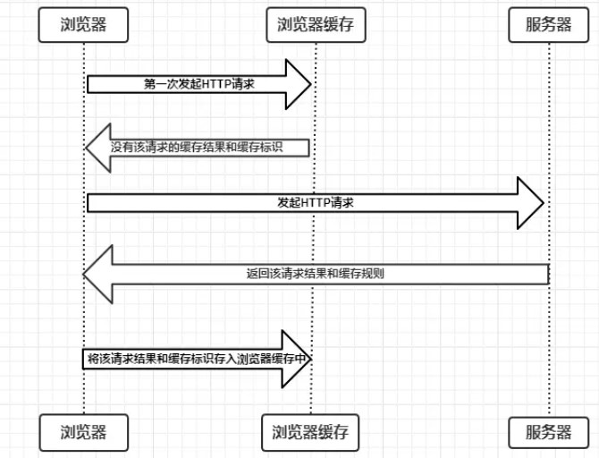
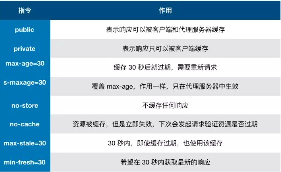
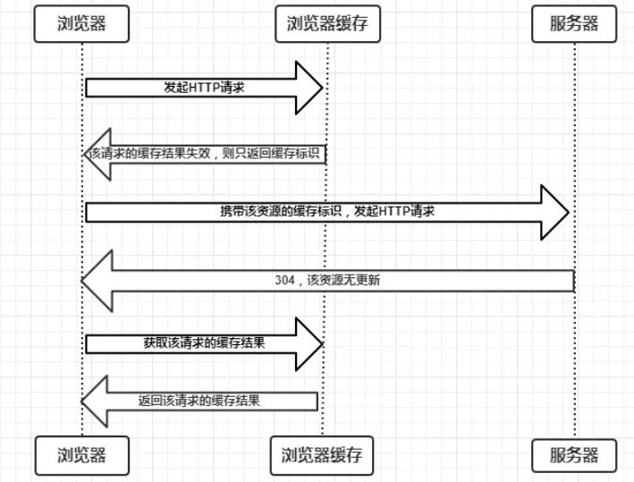
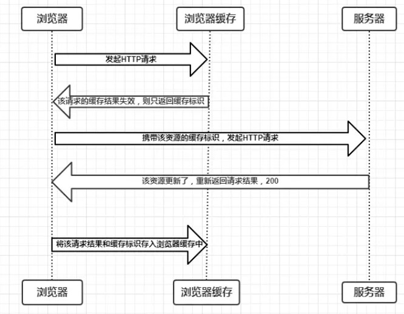
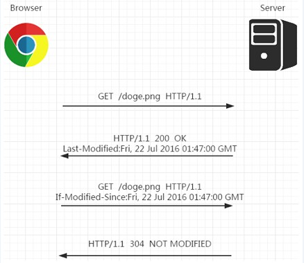
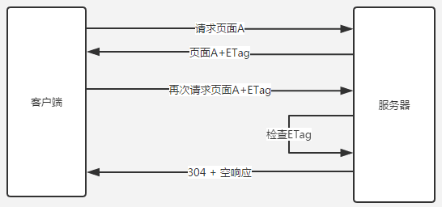
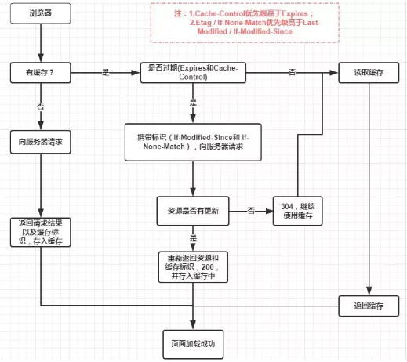

[简书文章链接](https://www.jianshu.com/p/54cc04190252)

## **缓存位置**

-   `Service Worker`
`Service Worker` 是**运行在浏览器背后的独立线程**，一般可以用来实现缓存功能。

使用 `Service Worker` 的话，传输协议必须为**`HTTPS`**。因为 `Service Worker` 中涉及到**请求拦截**，所以必须使用 `HTTPS` 协议来保障安全。

`Service Worker` 的缓存与浏览器其他内建的缓存机制不同，它可以让我们**自由控制缓存哪些文件、如何匹配缓存、如何读取缓存**，并且缓存是**持续性**的。

`Service Worker` 实现缓存功能一般分为三个步骤：首先需要先注册 `Service Worker`，然后监听到 `install` 事件以后就可以缓存需要的文件，那么在下次用户访问的时候就可以通过拦截请求的方式查询是否存在缓存，存在缓存的话就可以直接读取缓存文件，否则就去请求数据。

当 `Service Worker` 没有命中缓存的时候，我们需要去调用 `fetch` 函数获取数据。也就是说，如果我们没有在 `Service Worker` 命中缓存的话，会**根据缓存查找优先级去查找数据**。但是不管我们是从 `Memory Cache` 中还是从网络请求中获取的数据，浏览器都会显示我们是从 `Service Worker` 中获取的内容。
-   `Memory Cache`
`Memory Cache` 也就是内存中的缓存，主要包含的是当前页面中已经抓取到的资源，例如页面上已经下载的样式、脚本、图片等。**一旦我们关闭Tab页面，内存中的缓存也就被释放了**。

内存缓存中有一块重要的缓存资源是`preloader`相关指令（例如\`<link rel="prefetch">`）下载的资源。

需要注意的是，**内存缓存在缓存资源时并不关心返回资源的`HTTP`缓存头`Cache-Control`是什么值，同时资源的匹配也并非仅仅是对`URL`做匹配，还可能会对`Content-Type`，`CORS`等其他特征做校验**。
-   `Disk Cache`
`Disk Cache` 也就是存储在硬盘中的缓存，**比之 `Memory Cache` 胜在容量和存储时效性上。**

在所有浏览器缓存中，`Disk Cache` 覆盖面基本是最大的。它会**根据 `HTTP Herder` 中的字段**判断哪些资源需要缓存，哪些资源可以不请求直接使用，哪些资源已经过期需要重新请求。并且即使在跨站点的情况下，相同地址的资源一旦被硬盘缓存下来，就不会再次去请求数据。**绝大部分的缓存都来自 `Disk Cache`**。

一般来说：对于大文件来说，大概率是不存储在内存中的，反之优先；当前系统内存使用率高的话，文件优先存储进硬盘。
-   `Push Cache`
`Push Cache`（推送缓存）是 `HTTP/2` 中的内容，当以上三种缓存都没有命中时，它才会被使用。**它只在会话（`Session`）中存在，一旦会话结束就被释放，并且缓存时间也很短暂**，在Chrome浏览器中只有5分钟左右，同时它也并非严格执行`HTTP`头中的缓存指令。

如果以上**四种缓存都没有命中**的话，那么只能发起请求来获取资源了。为了性能上的考虑，大部分的接口都应该选择好缓存策略，通常**浏览器缓存策略**分为两种：**强缓存和协商缓存**，并且**缓存策略都是通过设置`HTTP Header`来实现的**。

## **缓存过程分析**

浏览器与服务器通信的方式为应答模式，即是：浏览器发起`HTTP`请求 – 服务器响应该请求，**那么浏览器怎么确定一个资源该不该缓存，如何去缓存呢**？浏览器第一次向服务器发起该请求后拿到请求结果后，将请求结果和缓存标识存入浏览器缓存，**浏览器对于缓存的处理是根据第一次请求资源时返回的响应头来确定的**。具体过程如下图：

由上图我们可以知道：

-   浏览器每次发起请求，都会先在浏览器缓存中查找该请求的结果以及缓存标识
-   浏览器每次拿到返回的请求结果都会将该结果和缓存标识存入浏览器缓存中
根据**是否需要向服务器重新发起`HTTP`请求**，将缓存过程分为两个部分，分别是**强缓存**和**协商缓存**。

## **强缓存**

**不会向服务器发送请求，直接从缓存中读取资源**，在chrome控制台的`Network`选项中可以看到该请求返回`200`的状态码，并且`Size`显示`from disk cache`或`from memory cache`。强缓存可以通过设置两种 `HTTP Header` 实现：`Expires` 和 `Cache-Control`。

-   **`Expires`**
指的是缓存过期时间，用来指定资源到期的时间，是服务器端具体的时间点。也就是说，`Expires = max-age + 请求时间`，需要和`Last-modified`结合使用。

**`Expires`是`HTTP/1`的产物，受限于本地时间，如果修改了本地时间，可能会造成缓存失效**。

-   **`Cache-Control`**
在`HTTP/1.1`中，`Cache-Control`是最重要的规则，主要用于控制网页缓存。

`Cache-Control`可以在请求头或者响应头中设置，并且可以组合使用多种指令：

-   **public**：**所有内容都将被缓存（客户端和代理服务器都可缓存）**。具体来说响应可被任何中间节点缓存，如 Browser \<-- proxy1 \<-- proxy2 \<-- Server，中间的proxy可以缓存资源，比如下次再请求同一资源proxy1直接把自己缓存的东西给 Browser 而不再向proxy2要。
-   **private**：**所有内容只有客户端可以缓存**，`Cache-Control`的默认取值。具体来说，表示中间节点不允许缓存，对于Browser \<-- proxy1 \<-- proxy2 \<-- Server，proxy 会老老实实把Server 返回的数据发送给proxy1,自己不缓存任何数据。当下次Browser再次请求时proxy会做好请求转发而不是自作主张给自己缓存的数据。
-   **no-cache**：客户端缓存内容，是否使用缓存则需要经过协商缓存来验证决定。表示不使用 `Cache-Control`的缓存控制方式做前置验证，而是使用 `Etag` 或者`Last-Modified`字段来控制缓存。**需要注意的是，`no-cache`这个名字有一点误导。设置了`no-cache`之后，并不是说浏览器就不再缓存数据，只是浏览器在使用缓存数据时，需要先确认一下数据是否还跟服务器保持一致。**
-   **no-store**：所有内容都不会被缓存，即不使用强制缓存，也不使用协商缓存
-   **max-age**：`max-age=xxx` (xxx is numeric)表示缓存内容将在xxx秒后失效
-   **s-maxage**（单位为s)：同`max-age`作用一样，只在代理服务器中生效（比如`CDN`缓存）。比如当s-maxage=60时，在这60秒中，即使更新了`CDN`的内容，浏览器也不会进行请求。`max-age`用于普通缓存，而`s-maxage`用于代理缓存。**`s-maxage`的优先级高于`max-age`**。如果存在`s-maxage`，则会覆盖掉max-age和`Expires header`。
-   **max-stale**：能容忍的最大过期时间。`max-stale`指令标示了客户端愿意接收一个已经过期了的响应。如果指定了`max-stale`的值，则最大容忍时间为对应的秒数。如果没有指定，那么说明浏览器愿意接收任何`age`的响应（`age`表示响应由源站生成或确认的时间与当前时间的差值）。
-   **min-fresh**：能够容忍的最小新鲜度。`min-fresh`标示了客户端不愿意接受新鲜度不多于当前的`age`加上`min-fresh`设定的时间之和的响应。

`Expires`和`Cache-Control`对比，区别就在于 `Expires` 是http1.0的产物，`Cache-Control`是http1.1的产物，**两者同时存在的话，`Cache-Control`优先级高于`Expires`。**

强缓存判断是否缓存的依据来自于是否超出某个时间或者某个时间段，而**不关心服务器端文件是否已经更新**，这可能会导致加载文件不是服务器端最新的内容，**我们如果要获知服务器端内容是否已经发生了更新，**此时我们需要用到**协商缓存策略**。

## **协商缓存**

协商缓存就是**强缓存失效**后，浏览器携带**缓存标识**向服务器发起请求，由服务器来根据缓存标识决定是否使用缓存的过程，主要分成两种情况：

- 协商缓存生效，返回`304`和`Not Modified`

  

- 协商缓存失效，返回`200`和请求结果

  

协商缓存可以通过设置两种 `HTTP Header` 实现：
-   **`Last-Modified` 和 `If-Modified-Since`**
浏览器在第一次访问资源时，服务器返回资源的同时，在`response header`中添加 `Last-Modified`的`header`，值是这个资源在服务器上的最后修改时间，浏览器接收后缓存文件和`header`；浏览器下一次请求这个资源，浏览器检测到 `Last-Modified`这个 `header`，于是添加 `If-Modified-Since` 这个 `header`，值就是 `Last-Modified` 中的值；服务器再次收到这个资源请求，会**根据 `If-Modified-Since` 中的值与服务器中这个资源的最后修改时间对比**。如果没有发生变化，返回`304`和空响应体，提示浏览器直接从缓存读取；如果`If-Modified-Since`的时间小于服务器中这个资源的最后修改时间，说明文件有更新，于是返回新的资源文件和`200`。

但是 `Last-Modified` **存在一些弊端**：
-   如果本地打开缓存文件，即使没有对文件进行修改，但还是会造成 `Last-Modified` 被修改，服务端不能命中缓存导致发送相同的资源
-   因为 `Last-Modified` **只能以秒计时**，如果在不可感知的时间内修改完成文件，那么服务端会认为资源还是命中了，不会返回正确的资源
-   **`ETag`和`If-None-Match`**
**`Etag`是服务器响应请求时，返回当前资源文件的一个唯一标识(由服务器生成)，只要资源有变化，`Etag`就会重新生成**。浏览器在下一次加载资源向服务器发送请求时，会将上一次返回的`Etag`值放到`request header`里的`If-None-Match`里，服务器只需要比较客户端传来的`If-None-Match`跟自己服务器上该资源的`ETag`是否一致，就能很好地判断资源相对客户端而言是否被修改过了。如果服务器发现`ETag`匹配不上，那么直接以常规`GET 200`回包形式将新的资源（当然也包括了新的`ETag`）发给客户端；如果`ETag`是一致的，则直接返回`304`知会客户端直接使用本地缓存即可。

两者之间对比：
-   在精确度上，`ETag`要优于`Last-Modified`
-   在性能上，`ETag`要逊于`Last-Modified`。因为`Last-Modified`只需要记录时间，而`ETag`需要服务器通过算法来计算出一个`hash`值
-   在优先级上，服务器校验优先考虑`Etag`

## **缓存机制**

强缓存优先于协商缓存进行，若强制缓存生效则直接使用缓存，若不生效则进行协商缓存，协商缓存由服务器决定是否使用缓存，若协商缓存失效，那么代表该请求的缓存失效，返回`200`，重新返回资源和缓存标识，再存入到浏览器缓存中；生效则返回`304`，继续使用缓存。具体流程图如下：

如果**什么缓存策略都没设置**，浏览器会采用一个启发性的算法，通常会**取响应头中的Date减去Last-Modified值得10%作为缓存时间**。
