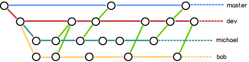

在实际开发中，我们应该按照几个基本原则进行分支管理：
首先，`master`/`release`分支应该是非常稳定的，也就是仅用来发布新版本，平时不能在上面干活；
那在哪干活呢？干活都在`dev`/`feature`分支（或者是自己的分支）上，也就是说，`dev`/`feature`分支是不稳定的，到某个时候，比如 1.0 版本发布时，再把`dev`/`feature`分支合并（`merge`）到`master`/`release`上，在`master`/`release`分支发布 1.0 版本；
你和你的小伙伴们每个人都在**自己的分支**上干活，每个人**都有自己的分支**，时不时地往`dev`/`feature`分支上合并就可以了。
所以，团队合作的分支看起来就像这样：

