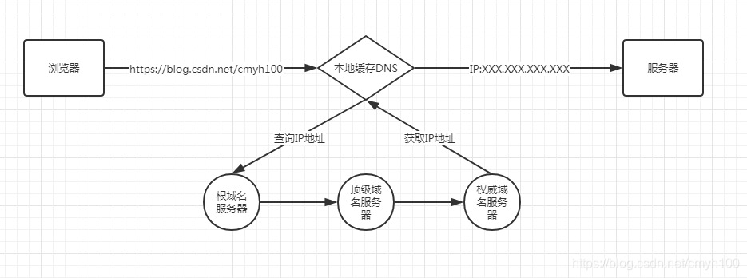
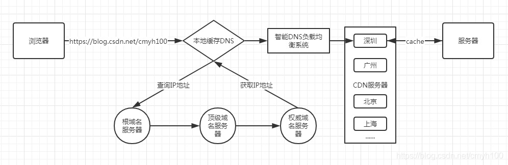

`Content Delivery Network`，即内容分发网络，通过各地部署的多套 `cache` 的静态镜像服务节点，通过空间来换取时间。用户向源站域名发起请求时，请求会被调度至最接近用户的服务节点，直接由服务节点直接快速响应，有效降低用户访问延迟，提升可用性。

未使用 `CDN`：

使用了 `CDN`：

使用 `CDN` 访问：用户发送请求 -> 智能 `DNS` 的解析（根据 IP 判断地理位置、接入网类型、选择路由最短和负载最轻的服务器） -> 取得缓存服务器 IP -> 把内容返回给用户（如果缓存中有） -> 向目标站发起请求 -> 将结果返回给用户 -> 将结果存入缓存服务器

优势：

- 本地 `Cache` 加速
- 跨运营商的网络加速，保证不同网络的用户都能得到良好的访问质量
- 远程访问用户根据 `DNS` 负载均衡技术智能自动选择 `Cache` 服务器
- 自动生成服务器的远程 Mirror（镜像）cache 服务器，远程用户访问时从 cache 服务器上读取数据，减少远程访问的带宽、分担网络流量、减轻原站点 web 服务器负载等功能
- 广泛分布的 `CDN` 节点加上节点之间的智能冗余机制，可以有效地防止黑客入侵
