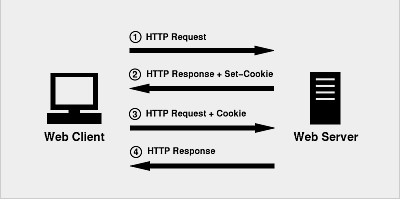
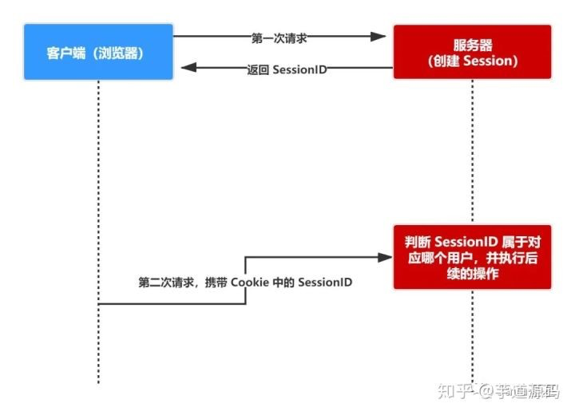
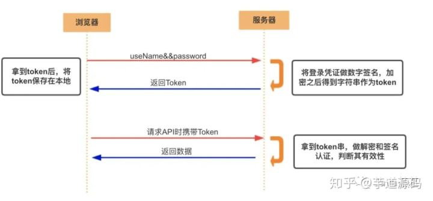

知乎链接：<https://zhuanlan.zhihu.com/p/152224669>

## **Cookie**

`Cookie`是一个具体的东西，指的就是浏览器里面能永久存储的一种数据，仅仅是浏览器实现的一种数据存储功能。
`Cookie`由服务器生成，发送给浏览器，浏览器把`Cookie`以`key-value`形式保存到某个目录下的文本文件内，下一次请求同一网站时会把该`Cookie`发送给服务器。
由于`cookie`是存在客户端上的，所以浏览器加入了一些限制确保`Cookie`不会被恶意使用，同时不会占据太多磁盘空间，所以每个域的`Cookie`数量是有限的。
`Cookie`是不可跨域的：每个 `cookie` 都会绑定单一的域名，无法在别的域名下获取使用，一级域名和二级域名之间是允许共享使用的（靠的是 `domain`）。
重要属性：

-   `maxAge`：`cookie`失效的时间，单位秒。如果为**整数**，则该 `cookie` 在 `maxAge` 秒后失效。如果为**负数**，该 `cookie` 为临时 `cookie` ，**关闭浏览器即失效**，浏览器也不会以任何形式保存该 `cookie` 。如果为 **0**，表示**删除**该 `cookie` 。默认为 -1。
-   `secure`：该 `cookie` 是否仅被使用安全协议传输。安全协议有 `HTTPS`，`SSL`等，在网络上传输数据之前先将数据加密。默认为`false`。当 `secure` 值为 `true` 时，`cookie` 在 `HTTP` 中是无效，在 `HTTPS` 中才有效。
-   `httpOnly`：如果给某个 `cookie` 设置了 `httpOnly` 属性，则无法通过 **`JS` 脚本** 读取到该 `cookie` 的信息，但还是能通过 **`Application`** 中手动修改 `cookie`，所以只是在一定程度上可以防止 `XSS` 攻击，不是绝对的安全。

## **Session**

`session` 是基于 `cookie` 实现的，`session` 存储在服务器端，`sessionId` 会被存储到客户端的`cookie` 中。
`session` 认证流程：

1.  用户第一次请求服务器的时候，服务器根据用户提交的相关信息，创建对应的 `Session`
2.  请求返回时将此 `Session` 的唯一标识信息 `SessionID` 返回给浏览器
3.  浏览器接收到服务器返回的 `SessionID` 信息后，会将此信息存入到 `Cookie` 中，同时 `Cookie` 记录此 `SessionID` 属于哪个域名
4.  当用户第二次访问服务器的时候，请求会自动判断此域名下是否存在 `Cookie` 信息，如果存在**（浏览器）**自动将 **（同一个主域下的）**`Cookie` 信息也发送给服务端，服务端会从 `Cookie` 中获取 `SessionID`，再根据 `SessionID` 查找对应的 `Session` 信息，如果没有找到说明用户没有登录或者登录失效，如果找到 `Session` 证明用户已经登录可执行后面操作。

## **`Cookie` 和 `Session` 的区别**

-   安全性： `Session` 比 `Cookie` 安全，`Session` 是存储在**服务器端**的，`Cookie` 是存储在**客户端**的。
-   存取值的类型不同：`Cookie` 只支持存**字符串**数据，想要设置其他类型的数据，需要将其转换成字符串，`Session` 可以存**任意数据**类型。
-   有效期不同： `Cookie` 可设置为长时间保持，比如我们经常使用的默认登录功能，`Session` 一般失效时间较短，客户端关闭（默认情况下）或者 `Session` 超时都会失效。
-   存储大小不同： 单个 `Cookie` 保存的数据不能超过 4K，`Session` 可存储数据远高于 `Cookie`，但是当访问量过多，会**占用过多的服务器资源**。

## **Token**

`Token`是用户身份的验证方式。最简单的`token`组成：uid(用户唯一的身份标识)、time(当前时间的时间戳)、sign(签名，由`token`的前几位+盐以哈希算法压缩成一定长的十六进制字符串，可以防止恶意第三方拼接`token`请求服务器)。还可以把不变的参数也放进`Token`，避免多次查库。
`Token`验证流程：

1.  客户端使用用户名跟密码请求登录
2.  服务端收到请求，去验证用户名与密码
3.  验证成功后，服务端会签发一个 `token` 并把这个 `token` 发送给客户端
4.  客户端收到 `token` 以后，会把它存储起来，比如放在 `cookie` 里或者 `localStorage` 里
5.  客户端每次向服务端请求资源的时候需要带着服务端签发的 `token`
6.  服务端收到请求，然后去验证客户端请求里面带着的 `token` ，如果验证成功，就向客户端返回请求的数据

-   每一次请求都需要携带 `token`，需要把 **`token` 放到 `HTTP` 的 `Header`** 里。
-   基于 `token` 的用户认证是一种服务端无状态的认证方式，服务端不用存放 `token` 数据。用解析 `token` 的计算时间换取 `session` 的存储空间，从而减轻服务器的压力，减少频繁的查询数据库。
-   `token` 完全由应用管理，所以它可以避开同源策略。

## **`Token` 和 `Session` 的区别**

-   `Session` 是一种记录服务器和客户端会话状态的机制，使服务端有状态化，可以记录会话信息。而 `Token` 是令牌，访问资源接口（`API`）时所需要的资源凭证。`Token` 使服务端无状态化，不会存储会话信息。
-   `Session` 和 `Token` 并不矛盾，作为身份认证 `Token` 安全性比 `Session` 好，因为每一个请求**都有签名还能防止监听以及重放攻击**，而 `Session` 就必须依赖链路层来保障通讯安全了。如果你需要实现有状态的会话，仍然可以增加 `Session` 来在服务器端保存一些状态。
-   所谓 `Session` 认证只是简单的把 `User` 信息存储到 `Session` 里，因为 `SessionID` 的不可预测性，暂且认为是安全的。而 `Token` ，如果指的是 `OAuth Token` 或类似的机制的话，提供的是 **认证** 和 **授权** ，认证是针对用户，授权是针对 App 。其目的是让某 App 有权利访问某用户的信息。这里的 `Token` 是唯一的。不可以转移到其它 App上，也不可以转到其它用户上。`Session` 只提供一种简单的认证，即只要有此 `SessionID` ，即认为有此 User 的全部权利。是需要严格保密的，这个数据应该只保存在站方，不应该共享给其它网站或者第三方 App。
-   所以简单来说：如果你的用户数据可能**需要和第三方共享**，或者**允许第三方调用 API 接口**，用 `Token` 。如果永远只是自己的网站，自己的 App，用什么就无所谓了。

## **Cookie、Session、Token三者关系**

`Token`就是令牌，比如你授权（登录）一个程序时，他就是个依据，判断你是否已经授权该软件；
`cookie`就是写在客户端的一个txt文件，里面包括你登录信息之类的，这样你下次在登录某个网站，就会自动调用`cookie`自动登录用户名；
`session`和`cookie`差不多，只是`session`是写在服务器端的文件，也需要在客户端写入`cookie`文件，但是文件里是你的浏览器编号。
`Session`的状态是存储在服务器端，客户端只有`session id`（通过`cookie`的方式储存）；而`Token`的状态是存储在客户端（通过`cookie`或者`localstorage`）。
