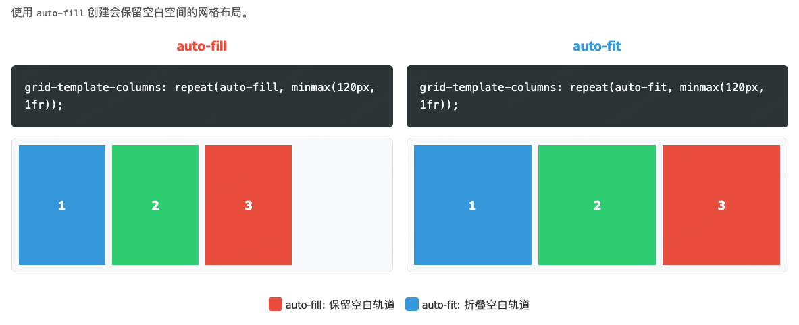

阮一峰 CSS Grid 网格布局教程

https://www.ruanyifeng.com/blog/2019/03/grid-layout-tutorial.html

## 为什么使用 grid 布局？

因为看到需要实现 n 行 n 列的效果，自然就会想到使用 grid 布局。

---

grid 布局默认的放置方式是**先行后列**，如果要想**先列后行**，可以使用 `grid-auto-flow: column` 这个属性来实现。

---

grid 布局的核心都是通过 `grid-template-columns` 和 `grid-template-rows` 来定义行列格

```css
display: grid;
width: 100%;
column-gap: 50px;
grid-template-columns: repeat(5, 20%);
```

## 这样的 `column-gap` 样式会导致里面的内容大于实际父容器的宽度，要怎么解决？

问题原因：计算宽度时，总宽度 = 5 列宽度之和 + 4 个间隙宽度，因此比 100% 长，就会出现滚动条。

两个问题：

我们一般针对这种固定距离的可以不去设置 20%，可以使用 fr 单位代替百分比，改成 `grid-template-columns: repeat(5, 1fr);`，使用 fr 单位会自动扣除间隙的宽度。

另外有些时候，内容有可能会超过预想的大小，默认情况下使用 fr 做单位的单元格宽度被设定为 auto，如果某个单元格过长会撑开影响布局。这个使用我们就要使用 `grid-template-columns: repeat(5, minmax(0, 1fr));`。这个代码的效果是：**创建 5 个列，每个列可以在 0 到平均分配的空间之间伸缩**。

通过`minmax(0, 1fr)`实现了三种重要的行为：

1. **重置最小宽度为 0**：
   - 覆盖默认的`auto`行为
   - 允许列宽被压缩到 0 像素（在极端情况下）
2. **强制列在容器内布局**：
   - 即使有非常长的内容（如 URL），列也会被限制在容器内
   - 内容会溢出但不会破坏布局结构
3. **保持空间分配的公平性**：
   - 当容器空间不足时，所有列按比例收缩
   - 没有内容的长列不会被特殊对待

这个技巧是 CSS Grid 布局中的最佳实践之一。

---

## `auto-fill` 和 `auto-fit` 的区别是？

在还有剩余空间的时候，`auto-fill` 会创建单元格来填充，而不会扩宽原来的单元格，而 `auto-fit` 会扩宽原来的单元格填满剩余空间。



https://css-tricks.com/auto-sizing-columns-css-grid-auto-fill-vs-auto-fit/ 这篇文章详细对比了二者的区别。

---

## Grid 布局的实用技巧和最佳实践 By deepseek

### 自适应网格列 (auto-fit/minmax)

使用 `auto-fit` 或 `auto-fill` 配合 `minmax()` 函数创建真正自适应的网格布局：

```
grid-template-columns: repeat(auto-fit, minmax(150px, 1fr));
```

- **auto-fit**: 尽可能多地创建列，并拉伸以填满可用空间
- **auto-fill**: 尽可能多地创建列，但会保留空白轨道
- **minmax()**: 设置列的最小和最大宽度

### 灵活的间距控制

使用 `gap` 属性和 `minmax()` 创建响应式间距：

```
gap: minmax(10px, 2vw);
```

- 提供最小间距保证
- 间距会随视口宽度缩放

### 解决内容溢出问题

使用 `minmax(0, 1fr)` 防止内容溢出：

```
grid-template-columns: repeat(3, minmax(0, 1fr));
```

将最小宽度设置为 0 可以防止内容强制列宽大于预期
