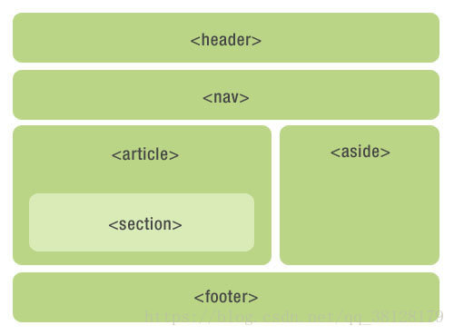

语义是指对一个词或者句子含义的正确解释。很多 `html` 标签也具有语义的意义，，也就是说元素本身传达了关于标签所包含内容类型的一些东西。

**为什么要语义化？**

-   **代码结构**：在页面没有 `css` 的情况下，亦可以呈现出很好的内容结构
-   **有利于 `SEO`**：爬虫依赖标签来确定关键字的权重，因此可以和搜索引擎建立良好的沟通，帮助爬虫抓取更多的有效信息
-   提高用户体验：`title`、`alt` 等属性可以用于解释名称或解释图片信息
-   利于团队开发和维护：语义化使得代码更具有可读性，让其他开发人员更加容易理解代码结构
-   **方便其他设备解析**：如屏幕阅读器、盲人阅读器、移动设备等可以用有意义的方式来渲染网页

**`HTML5`常用的语义标签**

`HTML5` 提供了新的语义元素来定义网页的不同部分，被称为“切片元素”：

以下是常见的语义元素：

| 结构体                                                       | 文本                                                         | 一致                                                         |
| ------------------------------------------------------------ | ------------------------------------------------------------ | ------------------------------------------------------------ |
| `header` 头部 `h1~h6` 标题 `nav` 导航栏 `footer` 底部 `article` 文章 `section` 一块具体的位置 | `p` 段落文本 `ul` 无须列表 `ol` 有序列表 `li` 列表项 `blockquote` 引用内容 | `a` 链接 `strong` 粗体 `em` 着重 `q` 引用（短） `abbr` 缩写 `small` 注释 |
