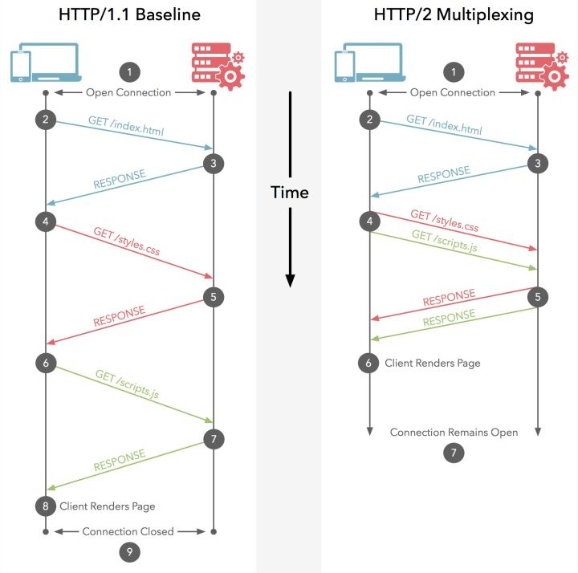
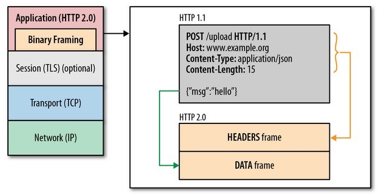
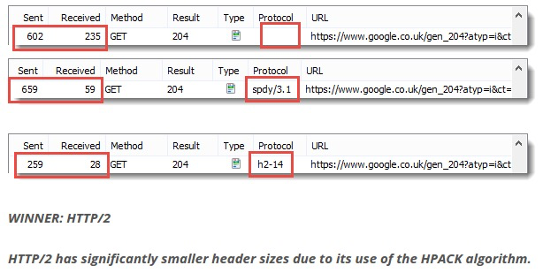

`HTTP 2.0` 的出现，相比于 `HTTP 1.x` ，大幅度的提升了 `web` 性能。在与 HTTP/1.1 完全语义兼容的基础上，进一步减少了网络延迟。

`Firefox` 和 `Chrome` 早已宣布不支持任何不经过 `TLS` 加密的 `HTTP/2` 协议。

## 多路复用

多路复用允许同时通过单一的 `HTTP/2` 连接发起多重请求-响应消息。

众所周知，在 `HTTP/1.1` 协议中，浏览器客户端在同一时间，针对同一域名下的请求有一定数量限制，超过限制数目的请求会被阻塞。

这也是为何一些站点有多个静态资源 `CDN` 域名的原因之一，可以变相地解决浏览器针对同一域名的请求限制阻塞问题。

而 `HTTP/2` 的多路复用则允许同时通过**单一的** **HTTP/2** **连接**发起多重的**请求-响应**消息。

因此 `HTTP/2` 可以很容易的去实现多流并行而不用依赖建立多个 `TCP` 连接，`HTTP/2` 把 `HTTP` 协议通信的基本单位缩小为一个一个的**帧**。

## 二进制分帧

在不改动 `HTTP/1.x` 的语义、方法、状态码、URI 以及首部字段……的情况下，`HTTP/2` 在应用层（`HTTP/2`）和传输层（`TCP` or `UDP`）之间增加一个**二进制分帧层**。

在二进制分帧层中，`HTTP/2` 会将所有传输的信息分割为更小的消息和帧（`frame`），并对它们采用二进制格式的编码，其中 `HTTP1.x` 的首部信息会被封装到 `HEADER frame`，而相应的 `Request Body` 则封装到 `DATA frame` 里面。

`HTTP/2` 通过让所有数据流共用同一个连接，可以更有效地使用 `TCP` 连接，让高带宽也能真正的服务于 `HTTP` 的性能提升。

总结：

- **单连接多资源**的方式，减少服务端的链接压力，内存占用更少，连接吞吐量更大
- 由于 `TCP` 连接的减少而使网络拥塞状况得以改善，同时慢启动时间的减少，事拥塞和丢包恢复速度更快

## 首部压缩

`HTTP/1.1`并不支持 `HTTP` 首部压缩，为此 `SPDY` 和 `HTTP/2` 应运而生。`HTTP/2` 使用了专门为首部压缩而设计的 **`HPACK`** **算法**。

## 服务端推送

服务端推送是一种在客户端请求之前发送数据的机制。在 `HTTP/2` 中，服务器可以对客户端的**一个**请求发送**多个**响应。如果一个请求是由你的主页发起的，服务器很可能会响应主页内容、logo 以及样式表，因为它知道客户端会用到这些东西。

服务端推送还有一个很大的优势：可以缓存！也让在遵循同源的情况下，不同页面之间可以共享缓存资源成为可能。
