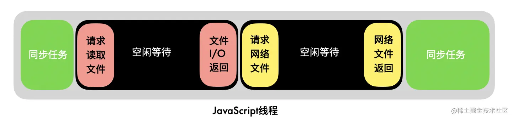

# JavaScript 事件循环

```js
(async () => {
  await new Promise((resolve) => {
    console.log(1)
    resolve()
  }).then(() => console.log(2))
  console.log(3)
})()

// 执行顺序 1 2 3
// 可以拆成几块看
await new Promise((resolve) => {
  console.log(1)
  resolve()
})
// 等同于
function
```

---

js 引擎是单线程的，直白来说就是一个时间点下 js 引擎只能去做一件事情。

单线程的**优势**：保证了程序执行的一致性。

最初作为浏览器的脚本语言，主要用途是与用户互动以及操作 DOM，如果以多线程的方式操作 DOM，线程 1 要求删除 DOM，线程 2 却要求修改 DOM 样式，就会发生冲突。当然可以引入锁的机制来解决冲突，但是这提高了复杂性，因此 js 从诞生开始就选择了单线程运行。

Q：那有没有可能在新的 js 版本之后改成多线程呢？

A：不太可能，存在历史问题，这种改动会影响十分多的线上代码，js 和浏览器最大的目的应该是保证兼容性，这种重大变更会影响兼容性，并且现在已经有成熟的事件循环机制来解决异步问题了，这件事情的成本和收益完全不对等。

**为了避免复杂性，从一诞生，JavaScript 就是单线程，这已经成了这门语言的核心特征，将来也不会改变**。

js 做的任务分为同步和异步两种，异步任务就是指一个任务不是连续完成的，先执行第一段，等做好了准备，再回过头执行第二段，第二段也被叫做回调。

像读取文件、网络请求这种任务就属于异步任务，花费时间很长，如果没有特殊处理的话，在执行异步的操作的时候是会存在等待的，不去做其他事情。类似下图：



可以看到中间有很多的空闲时间被浪费。

其实对于很多多线程的语言来说都是这样处理的，但是对于 js 这种单线程的语言来说，这种长时间的空闲等待是不可接受的。Java 可以多开一个线程继续去处理，js 就只能等。

所以 js 采取了「异步任务回调通知」模式：


在等待异步任务的时候，js 去执行其他的同步任务，等异步任务好了之后再去执行回调。

而实现这个通知的，就是**事件循环**，把异步任务的回调部分交给事件循环，在合适的时候去做合适的事情。

## 微任务的出现是为了什么？

事件循环分为微任务和宏任务，完成当下的宏任务后，会立刻执行在此期间入队的微任务。

这种设计其实是为了给紧急任务一个**插队**的机会，否则新入队的任务会永远放在队尾。微任务实际上就是在插队，我们可以看一下微任务的任务基本都是具有实时性质的，借助了事件循环去插队，使得异步事件也能**相对及时地**被处理，是在 js 单线程模式下一种「顾及了性能和时效性」的异步任务方案。

微任务都是些必须尽快执行的小任务。其时机晚于一段 JavaScript 执行上下文主体的退出，但早于任何事件处理函数、timeouts 或 intervals 及其他回调被执行。

> 事件循环中的任务被分为宏任务和微任务，是为了给高优先级任务一个插队的机会：微任务比宏任务有更高优先级。

Q：已经有一个宏任务队列，为什么还需要一个微任务队列？

微任务中的 DOM 更新会在当前任务完成后立即执行，并在下一次页面渲染前生效。

而宏任务中的 DOM 更新则会在下一个事件循环中执行，并稍有延迟。

## 宏任务一定准时吗？

setTimeout setInterval 设定多少秒就一定多少秒后执行吗？

这是错误的，setTimeout setInterval 只是在多少秒后会将回调函数推到宏任务队列中，如果主线程仍在忙、阻塞，那依旧会等待任务执行完成后，再从宏任务队列中拿出回调函数并执行。

## 定时器的计时器运行在 js 主线程上吗？

定时器的计时器在浏览器的实现里面有**一个独立的计时器线程**，因为 js 引擎自己都忙不过来 js 是单线程的，如果阻塞的话会影响计时的准确，因此需要一个独立的线程来计时。

微任务和宏任务有哪些？

宏任务：setTimeout setInterval setImmediate script DOM 事件 requestAnimationFrame I/O UI-Render

微任务：Promise process.nextTick queueMicrotask MutationObserver

## 在微任务里面去执行 long task 一样会导致页面阻塞，那微任务有什么用？

你在单个微任务去执行 long task 会导致阻塞，我们可以拆分开多个微任务去分步执行，这样事件循环机制会自动利用好不同的空隙去「相对及时地」完成任务。

但是如果这个任务是有前后关联性的，而且是无法优化的，那就考虑使用 worker 吧，在一个独立的线程中执行，跑完后再通知 js 主线程。

---

根据 w3c 最新的规范，已经不再使用宏任务队列这个说法了，包括了很多个队列，比如存放定时器的队列是延时队列，存放用户交互操作的是交互队列；还有浏览器一定要准备好的微任务队列，优先级是最高的。

https://html.spec.whatwg.org/multipage/webappapis.html#event-loops

https://www.zhoulujun.cn/html/webfront/ECMAScript/js6/2015_1110_345.html
