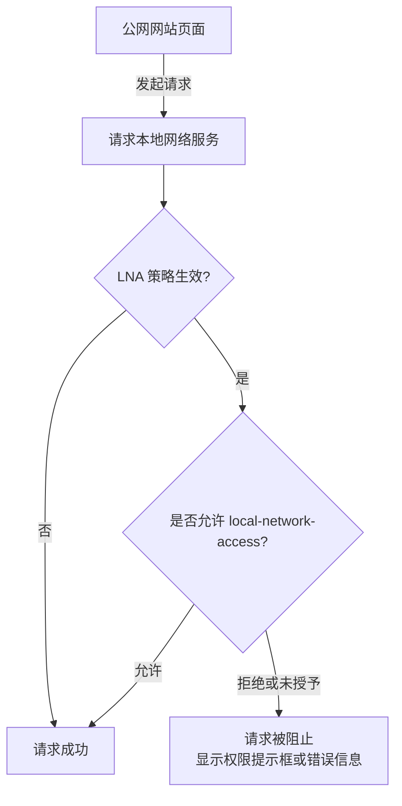
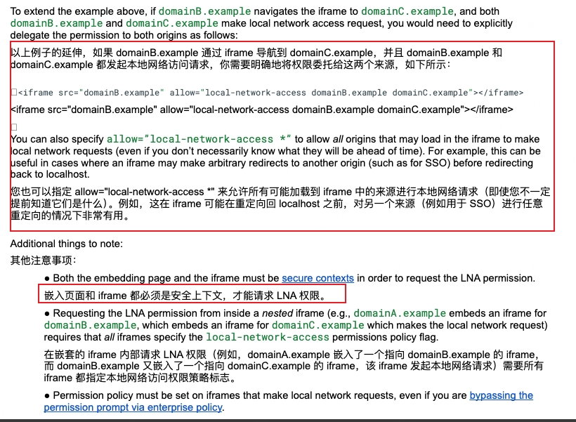
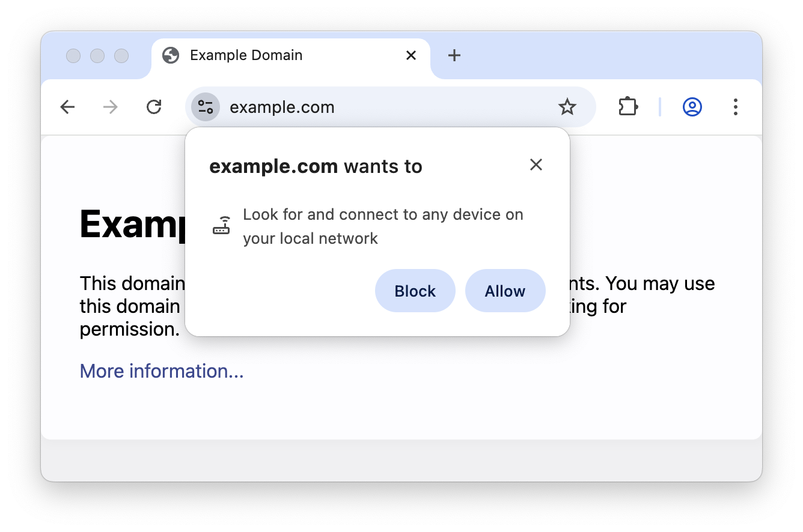

# Local Network Access

LNA 是 chrome 从 142 版本开始默认启用的一个功能，简单来说，LNA 出于保护本地服务的目的，会阻拦公网网站向本地网络发起的请求。本地网络的概念可以参考这个[链接](https://wicg.github.io/local-network-access/#non-public-ip-address-blocks)。

> 一些参考资料：
>
> [chrome blog](https://developer.chrome.com/blog/local-network-access?hl=zh-cn)
>
> [chrome status](https://chromestatus.com/feature/5152728072060928)
>
> [LNA Adoption Guide](https://docs.google.com/document/d/1QQkqehw8umtAgz5z0um7THx-aoU251p705FbIQjDuGs/edit?tab=t.0#heading=h.v8oobsqxbxxy)

如上图所示，当公网页面尝试访问本地网络服务时，Chrome 会根据 LNA 策略判断是否需要拦截，并根据用户是否授予 `local-network-access` 权限来决定请求最终是否能被执行。

一般来说，在公司内部有不少系统都会受到这个策略的影响。当前可以分为几种情况。

## Navigating subframes 导航子帧

举个最简单的例子，公司内部会用到飞书的 SSO 授权登录，当飞书登录成功后会回调回来内部系统的网站，内部系统的网站是部署在 172 网段的，这就是一个很典型的外网访问内网请求的 case。在 chrome 142 版本后，这种情况就会被 LNA 阻拦掉，现象如下：

提示「此连接已被阻止，因为它是公共页面发起的，旨在连接到您本地网络上的设备或服务器」。

我们可以在采用指南上找到如下描述：

针对这种情况，我们需要将内网地址和外网地址都部署在 https 下，然后给 iframe 添加 `allow="local-network-access"` 相关属性，此时当再次发生跳转的时候，就会弹出提示请求权限：

此时只要用户允许了这个权限，我们就能和以前一样正常进行跳转。但如果用户拒绝了，跳转将被阻止，出现和上面一样的错误。

## 资源请求

针对一些资源的请求（image/video等）和 fetch 请求，也会被 LNA 限制。

和上面聊到的一样，当发起此类请求的时候会有权限请求的提示框，如果权限没有被授予，此类请求就会被禁止请求，并在控制台中显示 CORS 错误。

## 最佳实践

针对用户权限请求，和其他权限（麦克风、定位等）请求一样，我们需要在用户请求前给予提示，引导用户允许请求，如果判断到用户拒绝了权限，也做一个优雅的降级，阻断当前行为并提示用户这个权限的重要性，并告诉用户如何重置权限（因为当前浏览器并没有提供编程式重置权限的途径，需要用户手动重置）。

这相关的内容在 web 体验优化相关的文章中会提到，可以自行展开研究。

由于 LNA 一般影响面最大在企业内部，企业也可以通过策略的方式，调整 `LocalNetworkAccessAllowedForUrls` 和 `LocalNetworkAccessBlockedForUrls` 两个参数来针对性的开放或拦截。使用通配符的方式，可以一次性将公司的二级域名都匹配上，一次性解决问题。

临时的解决方案也可以通过访问 `chrome://flags`，将 `Local Network Access Checks` 这一项 disabled 掉，也能临时解决问题。但是建议还是针对 LNA 做相关的适配，也许以后这个功能就常驻开放了。

------

总的来说，LNA 这个功能的出发点是好的，针对大多数普通浏览器用户可以有效地减少被攻击的可能性，对于有可能遭受影响的企业用户，也有提供对应的解决方案去解决，就是需要开发者针对这个 case 来进行一些适配，作为开发者的我们可以多关注一下 chrome 的一些新特性，等到用户反馈遇到情况再去修复就晚啦。