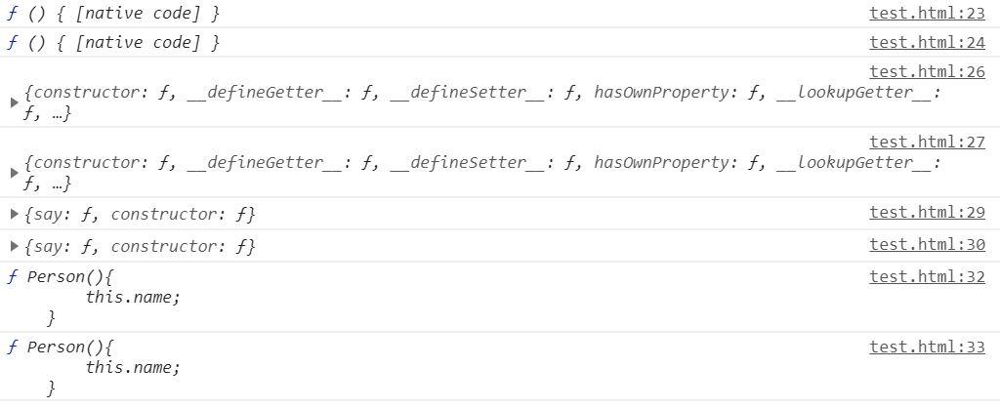

> 帮你彻底搞懂JS中的PROTOTYPE、\_\_PROTO\_\_与CONSTRUCTOR（图解）
> 
> [CSDN链接](https://blog.csdn.net/cc18868876837/article/details/81211729)

1.  我们需要牢记两点：①_proto_和_constructor_属性是**对象**所独有的；② _prototype_属性是**函数**所独有的，因为函数也是一种对象，所以函数也拥有_proto_和_constructor_属性。
2.  _proto_属性的作用就是当访问一个对象的属性时，如果该对象内部不存在这个属性，那么就会去它的_proto_属性所指向的那个对象（父对象）里找，一直找，直到_proto_属性的终点null，再往上找就相当于在null上取值，会报错。通过_proto_属性将对象连接起来的这条链路即我们所谓的**原型链**。
3.  _prototype_属性的作用就是让该**函数所实例化的对象**们都可以找到**公用的属性和方法**，即f1._proto_ === Foo._prototype_。
4.  _constructor_属性的含义就是指向**该对象的构造函数**，所有函数（此时看成对象了）最终的构造函数都指向Function。


<p style="text-align: center;">原型链解释图</p>

* * *

## 方便理解的代码

```javascript
function Person(){
	this.name;
}

Person.prototype.say=function(){
	console.log("hello");
}

var person=new Person();

// 指向 Function 的 prototype
console.log(Person.\_\_proto\_\_);
console.log(Function.prototype);

// Person.prototype.\_\_proto\_\_ 指向 Object.prototype
console.log(Person.prototype.\_\_proto\_\_);  
console.log(Object.prototype);

console.log(person.\_\_proto\_\_);
console.log(Person.prototype);

// constructor 从对象指向一个函数 即自身的构造函数
console.log(Person.prototype.constructor);  
console.log(Person);
```



<p style="text-align: center;">运行结果</p>