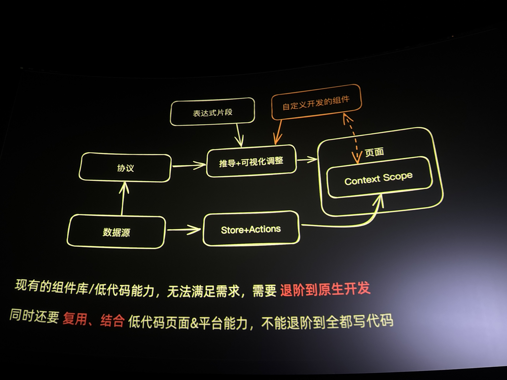

# VueConf 25

## Vue & Vite 5 星

Evan You：https://mp.weixin.qq.com/s/S0DYFfwvMIGsQJpe3JsrrQ

https://github.com/VueConf/2025

### Vue

前面分享了 Vue 和 Vue 3 的增长趋势。

Vue language tools 3.0 IDE 稳定性提升

重点是 Vue 3.6 alpha 发布，提供了全新的 Vapor mode。后面会有同学专门说到 Vapor mode 这一块，这里暂时不展开。

Vapor mode 将响应式系统又重构了一遍，借助了 Alien Signals，在当时达到了性能排名的第一位。

除了 react 以外都应用上了 signal 响应式的开发模式，这块估计后续也会是主流，甚至 ES 规范也有提这块的 API。

Vapor mode 是一个为了**极致性能**而存在的全新的编译和渲染模式

行为一样，不一样的是 sfc -> render 编译输出，支持**细粒度的启用**

3.6 可以通过 `<script setup vapor>` 在组件级别启用

### Vite

Framework with Vite plugin

现在有很多框架都是通过 Vite plugin 的形式去实现的

JavaScript 庞大的生态下有太多选择，这也是一个幸福的烦恼，带来的问题就是十分混乱。

JavaScript 语言已经发展壮大，带来了丰富的选择，随着最佳时间的沉淀，evan 觉得一体化工具链的时机已经到来。

evan 喜欢做统一的事情，简化用户的使用成本，也喜欢把东西都包起来，这也算他为什么要做这个事情

rolldown 目前核心打包功能可用，整合 Oxc 用于 parse 和 transform，支持更高级的功能，兼容性对齐 esbuild 和 rollup，rolldown 将很多 rollup 的插件功能作为内置，目前可以通过 overrides 的形式去尝试 rolldown-vite 了。

TODO 可以尝试去用 rolldown vite 了

如果之前用的 plugin 多的时候，切换到 rolldown 性能会提升不少。

有些大厂还是会使用 webpack 或者 rspack，因为他们用了一些高阶功能，比如高级分包等，现在 rolldown 也逐渐开始支持这些高级分包。

疑问：CJS 也支持 tree shaking？

针对大型项目，Vite 也在 WIP Full Bundle Mode，针对这种情况可以优化 dev 下页面的 load 性能。因为大型项目的内容会很多，提前打包等于是用空间换取了冷启动的时间，是有收益的。

Oxlint 发布了 1.0，针对中大型项目，就是使用 eslint 要挺久的，切换到 Oxlint 有可能会有提升。（但最近看群友的反馈，普通情况下还是用 Eslint 效率会高一点，这块就后续继续观望一下）

Rust 写的基建工具会面临一个问题，它们支持使用 JavaScript 去写插件，但是这就涉及到了两个语言之间的通信。很多时候一跑 JS 插件，rust 性能就差，中间有传输的开销。

因此团队尝试开发了一个 Raw AST transfer 的黑科技，可以优化两个语言之间的传输开销。

同时团队开发的 tsdown 是 tsup 的继承者，基于 Rolldown 实现，是一个高阶的包打包工具。

cargo 在 rust 开发的时候，不只是一个包管理器，还能有很多开发时候使用的工具，Vite 想做的就是 JavaScript 届的 cargo。这个愿景我个人是愿意观望的，因为做成这个事情之后，前端整体的技术选型会变得更加统一，降低了技术选型时的压力，同时在更高阶的场景下我们也可以选择对应的工具去进行具体情况的解题。

在用 AI 的时候，工具链的分散也会有挑战，你需要通过 prompt 或者 rule 去告诉 AI 什么情况要用什么工具，Vite+ 也出于这个目的，给 AI 提供了一个既定的 scope，让 AI 在这里面具体的场景都有具体的工具可用，而不需要去尝试学习文档，减少出问题的情况。

当时想提问的问题，但是没问上：

Vite 成功是因为什么？我算比较早使用 Vite 的一批人，甚至还没有中文文档，当时只是觉得很快，没想到发展这么迅速。

## Patak

https://vueconf-cn-25-patak.vercel.app

一个外国人进行的分享，聊了 Vite 5 年的发展历程。

## TSSLint 3 星

Johnson Chu：

IDE 保存时会遇到右下角请求 code action 时卡顿的问题，这个问题我也经常遇到，但是我的解决方法是点一下 skip 跳过，或者 reload window 重载一下 vscode，没有想过这是一个大问题。

大佬和我的区别就是他能发现到这个问题，并尝试去解决。这个主题就是聊怎么解决这个卡顿的问题。

**根本原因**

- TypeScript 扩展与 ESLint 扩展各自维护独立语言服务实例，导致重复解析和诊断
- 传统流程：文件保存 → TS 诊断 → Linter 诊断 → 双重开销。

**解决方案：TypeScript Language Service Plugin**

**1. 核心机制**

- **共享语言服务实例**：
- 插件能力：
  - 修改 Language Service API 结果（如诊断/代码操作）
  - 暴露 Language Service 实例
  - 控制文件类型识别（如 Vue 文件）

**2. 技术实现**

- **统一诊断流程**：
- Linter 直接复用 TypeScript AST，避免重复解析。

大佬的技术能力自然是没话说，后面许多主题的分享都有 thanks for johnson 的环节，但是可能是因为大佬比较 I 一点，个人感觉分享观感有点差，估计分享能力这块不是大佬的强项，不过这也可能是我的问题哈哈哈。

## Vue Vine 4 星

沈青川: https://vue-vine-ppt-2025.vercel.app/1

Vue Vine 是一种类似 JSX 的 Vue 组件写法，用函数 + 模版字符串函数的方式来声明 Vue 组件。

在聊的过程中提到了 tsgo，即 ts7。我们平时用的是 ts5，用 go 重写的 typescript 发布后就叫 ts7。

为什么在 Vue 中结合 typescript 使用的时候，需要 defineProps，因为 Vue 编译时是需要知道有哪些是 props 有哪些是 attribute，Evan 写了一个小型的 tsc，基于 AST 解析的方案去发现类型定义中的 props，所以会有一些奇怪的现象，这块是不完备的。

使用 `ts-morph` 去获取 TS 编译器进程，自然就可以获取到完整的类型环境上下文，同时也就能获取到正确、完整的 props 属性名。

上面是针对编译环节，编译器是独立运行，所以需要外挂 `ts-morph`。

而针对 VSCode 插件提示支持这一块，由于 VSCode 本身就有 tsserver 进程，因此语言服务插件不需要 `ts-morph`。不需要归不需要，但是我们要想办法去跟 tsserver 进行通信，才能拿到它里面我们想要的东西。

用了一点骚操作，通过在 ts server plugin 去提供一个 websocket 服务器，ts server 中有自己的上下文，通过 websocket 提供 rpc 调用，给外部获取到 tsserver 相关的上下文。

然后 language server 通过去连接这个 websocket，实现 language server 与 tsserver 的打通。

## Vue Vapor 5！星

小音: https://rizumu-slides-2025-07-12.netlify.app/1

Vue Vapor 是一个没有虚拟 DOM 的模式。

原生 JavaScript 操作 DOM 是性能表现最好的，但需要很多的技巧和繁复的操作，这就是框架存在的价值。框架帮我们省去了很多工作，能快速进行开发。

然后自然就会想到，如果我们将原生 JavaScript 的那些技巧尝试用在框架开发中，使用原生 JavaScript 进行开发，同时保留响应式，不使用虚拟 DOM，是不是就能有十分优秀的性能？

总的来说，上面这段就是 Vue Vapor 最开始的想法。

上面是基础的架构，可以通过这篇文章去了解 Vapor：https://github.com/ubugeeei/reading-vuejs-core-vapor

### 开源历程

开源历程可以参考，尝试关注 X 上大牛的情况

大型的项目需要更多的时间和更强的能力，新手可以尝试去从边缘库开始贡献，可以先从修改文档、提交测试用例开始，逐步去完善了解整个库，当了解得差不多，就可以从一些熟悉的功能开始贡献，提交一些修复，再到新功能，再到新 idea 的贡献。

**兴趣是最好的老师**

不需要给自己太大压力，开源就是可以用自己喜欢的时间和舒适的方式去 coding。

## 无极低代码 前面原来是广告，后面干活 4 星

吕洋：https://aiready-bundler-n-editor-repl.netlify.app/

目前看无极低代码平台这种成熟的平台也避免不了写代码的问题，避免不了它们的解题思路是用 AI 去辅助代码小白去写代码，即用自然语言区产出代码。

缺点：解决不了大模型的幻觉问题

解法：从工程化的手段实现自动纠一些错，结合 typescript 的类型检查去保证完善性

复杂的需求难以一次完成，需要进行需求拆分和职责划分，细粒度地针对每一个场景进行单块开发。

AI 不擅长做特别复杂的任务，prompt 会很长，也容易出现理解错误，因此任务拆分是很重要的一个环节。

代码运行错误时，AI 如何修复？解法无非就是运行起来，收集错误，然后让 AI 再次纠错。最近做 AI 项目做下来发现，涉及到 AI 出 code 的情况，一般都需要一个纠错的过程来保证结果正确。

对话中能插入自动生成+构建的组件，构建是怎么解决的呢？

问题就出来了：针对快速验证 idea 的场景，我们需要在浏览器快速运行 html。

解法有：

- 直接使用静态 HTML 运行，结合 cdn 使用 babel、unocss、vue 等框架，但问题就是使用 vue 的 cdn，就没办法享受 `<script setup>` 这种语法了。

- 使用带构建能力的有 stackblitz 和 CodeSandbox，还有 Vue Repl 和 TypeScript Playground 等，最近在尝试 rolldown，这种原生打包的工具也能编译为 wasm 提供给浏览器环境去使用。

小白想要的是直接聊完就把项目起好，因此我们需要规定与搭建一个浏览器可用的标准环境和流程。

rolldown 支持 wasm，可以将 rolldown 放到 wasm 中进行使用，可以直接编译代码

总结下来其实就是 browser compile code 的问题要如何解。

TODO browser 的 file system 是怎么解决的？

这是一个结合 AI 较完整的一个架构图，可以看到在浏览器侧编写并编译代码涉及了许多方面，同时有 AI 可介入的点，这个在以后的工作中如果有需要可以参考这个架构去尝试搭建与实现。

总体来说，browser coding 有很多方向可以展开，想象的空间很多，是一个值得研究的问题。

## Vue JSX Vapor 4 星

高飞: https://ppt.zmjs.dev/1

Vue JSX Vapor 提供了更多新的特性，同时支持了 Vapor 模式。

开发 vapor 模式过程中，JSX 的 map 表达式的性能不太理想

在后面 jsx vapor 2.0，支持了所有的指令

JSX vapor 支持 interop 模式，可以令 Vapor 组件和虚拟 DOM 组件一起使用

限制：

- 解构的 prop 会失去响应式，解决方法是直接传入 ref 对象
- rest 参数（...）的 attrs 也会失去响应式，和上面是差不多的问题

解法：使用 vue-macros，用一些 hack 的方法去实现

本质上其实是引入了一些虚拟代码，会通过宏的方式来对代码进行一个转换，将原本不支持的语法转变成支持的写法。

## alien signal Vue reactivy system 演进 4 星

Docter Wu：https://talks.doctorwu.me/conf_vue2025

TODO 这一块还是挺有意思的，后面可以看看分享的 PPT

响应式系统经常会接触的问题就是**毛刺问题**。可以结合钻石依赖解构来理解什么是毛刺问题。

Vue 响应式系统中会通过 schedule 去管理 effect，因此不应该出现的中间响应式状态即不会出现。

dirty 值检查

染色算法

push-pull-based propagation 结合推和拉的传播算法。当值变化时，先发送轻量级的通知，然后消息者根据通知请求拉取信息

↑ alien signal 的通知响应机制

## UI 视图与请求状态 4 星

Eduardo：https://esm.is/2025-pinia-colada-talk-zh

提出一个问题：请求过程中如何让 UI 视图变更，提升用户体验？

减少等待时间几要素：

- 异步操作更快
- 更早地开始执行
- 让它们 **感觉** 起来更快

### Pinia colada

是不是类似 react query 或者 swc 的请求框架，pinia 是请求数据的载体？

没错，下课之后和大佬沟通了解下，这个框架和 pinia 有关系的地方，就是它使用了 pinia 作为数据存放的载体。

响应时间：

- <= 100ms：几乎是一瞬间
- <= 1s：用户操作不易被打断
- \>= 10s ：会感到上下文切换，用户会去做其他的事情

举个例子，以飞机拿托运行李为例，早点放你下来等 7 分钟，体验比不上让你在飞机上面等 5 分钟，然后你下来等 2 分钟拿到行李的体验好。

稍稍延迟 spinner，就会让用户有更良好的体验。

预测未来：

- 预请求
- 乐观更新（先去改变本地数据，然后再去发起请求，让用户体验会好很多。但需要注意的是，乐观更新适用于数据准确性没那么高的需求中，如果有高准确性的需求不建议使用乐观更新）

## tsdown 库打包工具 5 星

三咲智子：https://talks.sxzz.dev/2025-07-vueconf/1

库打包工具的痛点：

- 配置繁琐
- 类型声明难搞，要输出合适的类型声明
- 多格式易出错
- 性能瓶颈

tsdown 定位就是为现代库开发而生，tsdown 基于 rolldown 实现。

https://tsdown.dev/

tsdown 可以支持打包那种即运行在 nodejs，也运行在 browser 上面的库，和 Vite 不太一样，Vite 打包库模式预设默认是 nodejs 库。

tsdown 还提供了许多开箱即用的功能，比如：

- 支持自动生成 package.json 的 exports 字段，开发时可以指向源码，发布时自动切换。
- 支持自动导入或打包以来，默认将 `dependencies`/`peerDependencies` 外部化，不打包到产物中

目前看 tsdown 官方中，tsdown 已经是 Rolldown Vite lib mode 后续的核心基座。目前我也尝试在使用 Rolldown Vite 的 lib mode 进行打包，现在看是直接使用的 rolldown 进行打包，后面应该会切换成 tsdown。

## Vue Language Tools 4 星

山吹色御守：https://bikari-vueconf-2025.netlify.app

在开始之前，我们可以了解下 Vue Language Tools 是什么。我听课的时候，默认这个东西就是我们平时 VSCode 中使用的 Vue official 插件，也就是 Language Server 相关的东西。在回去研究了一下后发现，其实 Vue Language 是一个 package，Vue official 是其中的一个包，这下面还有其他的内容：

- [Vue (Official)](https://github.com/vuejs/language-tools/tree/master/extensions/vscode)
  _Vue, Vitepress, petite-vue language support extension for VSCode_
- [vue-tsc](https://github.com/vuejs/language-tools/tree/master/packages/tsc)
  _Type-check and dts build command line tool_
- [vue-component-meta](https://github.com/vuejs/language-tools/tree/master/packages/component-meta)
  _Component props, events, slots types information extract tool_
- [`@vue/language-server`](https://github.com/vuejs/language-tools/blob/master/packages/language-server)
  _The language server itself_.
- [`@vue/typescript-plugin`](https://github.com/vuejs/language-tools/blob/master/packages/typescript-plugin)
  _TypeScript LanguageService Plugin for Vue_.

这些语言工具都是 Vue Language Tools 内含的工具。同时，这个 toolset 都是基于 `Volar.js` 实现的，这个 Volar 和我们平时说的 VSCode 插件 Volar 不是一个东西，这个 Volar.js 是一个语言服务器的框架，后面可以去研究下这个东西是什么和具体可以用来做什么。

https://volarjs.dev/core-concepts/why-volar/

TODO volar 虚拟文件这个概念提到好多次了，回去看看是啥东西

通过这个方式去优化 Vue SFC 解析的开销，细粒度代码块，去辨别究竟是哪一块进行了变化，然后进行增量更新。

最终的目的是，每次更新时，只更新此次更新影响的值，不进行额外的计算。

V2 中用的是命名管道实现通信

V3 则是直接进行通信，性能应该跟原生 typescript 性能近乎一样。

这一 part 基本是介绍 Vue language tools 是什么，做了什么工作，同时在 3.0 版本中通过增量更新和替换命名管道来优化性能。

## Vite Devtools 5 星

antfu: https://talks.antfu.me/2025/vueconf-china/1

好工具原则：

- 入门门槛低，容易上手，简单配置，一句话说明白在做什么
- 符合直觉的设定，符合用户期待和直觉，优秀的用户体验，渐进式
- 信息透明，可以看到内部的状态和过程，便于调试和优化
- 可组合性，模块互相解耦，易于组合和扩展
- 可扩展性，灵活的插件和配置系统

一个题外话问题：Vitest 到底用了什么 Vite 的能力，才说是基于 Vite 开发的？

因为现在还是 WIP 阶段，下面是一些它的预览截图：

因为 Vite 后面预期是做 Vite+，因此 Vite Devtools 要有可扩展性，作为底层框架的 Devtools，要提供给上层框架去使用，因此会考虑模块化、可组合、互相协作的结构框架。

https://github.com/vitejs/devtools

这个库现场开源了，我也尝试 fork 下来做点贡献，希望这个以后真的可以大一统前端框架，我对 Vite+ 还是有期望的。
