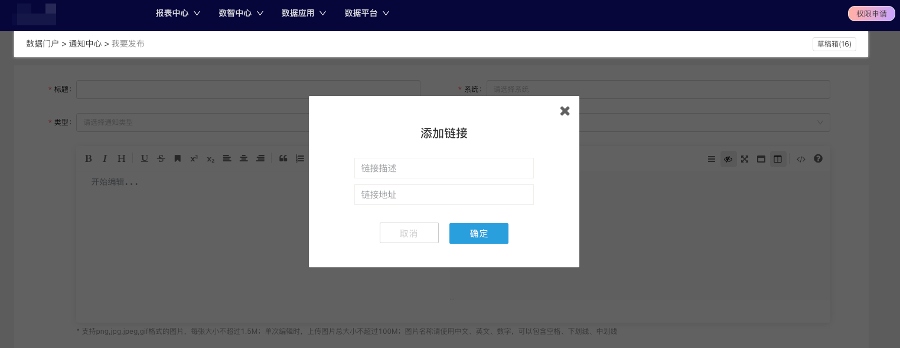
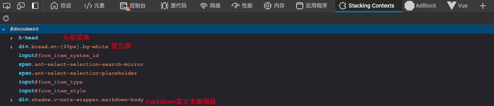

# 理解 z-index

## 背景



在开发通知的编辑页面时，使用到了 mavon-editor 这个库。这个富文本编辑器库有提供一些方便的功能，比如添加链接时友好的弹窗，可以方便不了解 markdown 语法的人进行编辑。

但在使用过程中发现，这个弹窗的遮罩层无法遮住面包屑与头部菜单。在「元素」页面下，我们看到了这其实是 z-index 与层叠上下文导致的。

## z-index 与层叠上下文

在页面中，我们经常会有用到 `z-index` 这个属性，而配合这个属性使用的一般还有 `position` 属性，`z-index` 一般会运用在脱离文档流的元素中，比如绝对定位、固定定位等元素。

在脱离文档流的元素中，我们可以通过调整 `z-index` 去决定元素的层叠顺序。但在多级元素的场景下，层叠上下文的存在会使得一些场景变得复杂。接下来先简单了解一下层叠上下文这个概念。

文档中的层叠上下文由满足以下任意一个条件的元素形成：

- 文档根元素（`<html>`）；
- [`position`](https://developer.mozilla.org/zh-CN/docs/Web/CSS/position) 值为 `absolute`（绝对定位）或 `relative`（相对定位）且 [`z-index`](https://developer.mozilla.org/zh-CN/docs/Web/CSS/z-index) 值不为 `auto` 的元素；
- [`position`](https://developer.mozilla.org/zh-CN/docs/Web/CSS/position) 值为 `fixed`（固定定位）或 `sticky`（粘滞定位）的元素（沾滞定位适配所有移动设备上的浏览器，但老的桌面浏览器不支持）；
- flex ([`flex`](https://developer.mozilla.org/zh-CN/docs/Web/CSS/flex)) 容器的子元素，且 [`z-index`](https://developer.mozilla.org/zh-CN/docs/Web/CSS/z-index) 值不为 `auto`；
- grid ([`grid`](https://developer.mozilla.org/zh-CN/docs/Web/CSS/grid)) 容器的子元素，且 [`z-index`](https://developer.mozilla.org/zh-CN/docs/Web/CSS/z-index) 值不为 `auto`；
- [`opacity`](https://developer.mozilla.org/zh-CN/docs/Web/CSS/opacity) 属性值小于 `1` 的元素（参见 [the specification for opacity](https://www.w3.org/TR/css3-color/#transparency)）；
- [`mix-blend-mode`](https://developer.mozilla.org/zh-CN/docs/Web/CSS/mix-blend-mode) 属性值不为 `normal` 的元素；
- 以下任意属性值不为 `none` 的元素：
  - [`transform`](https://developer.mozilla.org/zh-CN/docs/Web/CSS/transform)
  - [`filter`](https://developer.mozilla.org/zh-CN/docs/Web/CSS/filter)
  - [`backdrop-filter`](https://developer.mozilla.org/zh-CN/docs/Web/CSS/backdrop-filter)
  - [`perspective`](https://developer.mozilla.org/zh-CN/docs/Web/CSS/perspective)
  - [`clip-path`](https://developer.mozilla.org/zh-CN/docs/Web/CSS/clip-path)
  - [`mask`](https://developer.mozilla.org/zh-CN/docs/Web/CSS/mask) / [`mask-image`](https://developer.mozilla.org/zh-CN/docs/Web/CSS/mask-image) / [`mask-border`](https://developer.mozilla.org/zh-CN/docs/Web/CSS/mask-border)
- [`isolation`](https://developer.mozilla.org/zh-CN/docs/Web/CSS/isolation) 属性值为 `isolate` 的元素；
- [`will-change`](https://developer.mozilla.org/zh-CN/docs/Web/CSS/will-change) 值设定了任一属性而该属性在 non-initial 值时会创建层叠上下文的元素（参考[这篇文章](https://dev.opera.com/articles/css-will-change-property/)）；
- [`contain`](https://developer.mozilla.org/zh-CN/docs/Web/CSS/contain) 属性值为 `layout`、`paint` 或包含它们其中之一的合成值（比如 `contain: strict`、`contain: content`）的元素。

在一个层叠上下文中，如果其子元素也存在新的层叠上下文，则它的 `z-index` 值只会在父级中才有意义，换句话说，子元素的 `z-index` 值不会跳出它的父元素与其他层叠上下文去比较。

### 示例

有一个简单的示例可以方便我们去理解：


在这里我们可以简单梳理一下上面例子的层叠上下文关系：

- Root
  - DIV #1
  - DIV #2
  - DIV #3
    - DIV #4
    - DIV #5
    - DIV #6

在这个例子中，我们可以看到一个最明显的现象：DIV#4 虽然它的 z-index 是 6，但是并没有在最上层，因为它的 z-index 受父级元素限制，父级元素 DIV#3 的 z-index 是 4，DIV#4 这个 6 的 z-index 只会在 DIV#3 内部发挥作用，因此可以看到在 DIV#3 里 DIV#4 是在最顶层。

在 MDN 上，有一个较为简单易理解的方式去解释这种现象：

> 分辨出层叠的元素在 Z 轴上的*渲染顺序*的一个简单方法是将它们想象成一系列的版本号，子元素是其父元素版本号之下的次要版本。通过这个方法我们可以轻松地看出为什么一个 z-index 为 1 的元素（DIV #5）层叠于一个 z-index 为 2 的元素（DIV #2）之上，而一个 z-index 为 6 的元素（DIV #4）层叠于 z-index 为 5 的元素（DIV #1）之下。在我们的例子中（依照最终渲染次序排列）：
>
> - Root
>   - DIV #2 - z-index 为 2
>   - DIV #3 - z-index 为 4
>     - DIV #5 - z-index 为 1，在一个 z-index 为 4 的元素内层叠，所以渲染次序为 4.1
>     - DIV #6 - z-index 为 3，在一个 z-index 为 4 的元素内层叠，所以渲染次序为 4.3
>     - DIV #4 - z-index 为 6，在一个 z-index 为 4 的元素内层叠，所以渲染次序为 4.6
>   - DIV #1 - z-index 为 5

## 回到项目中

回到我们自己的项目中，我们也可以分析下我们这个项目的层叠上下文关系，此处我借助了一个 chrome extension：[CSS Stacking Context inspector](https://chromewebstore.google.com/detail/apjeljpachdcjkgnamgppgfkmddadcki)，这个拓展可以帮助我们直观地看到文档中的层叠上下文。



这里面可以看到，头部菜单、面包屑、富文本编辑器都存在一个层叠上下文，这是符合预期的。那为什么会出现前面说到的，遮罩无法在最上层呢？

```html
<div class="markdown-editor" formcontent="">
  <div
    class="shadow v-note-wrapper markdown-body"
    style="box-shadow: rgba(0, 0, 0, 0.1) 0px 2px 12px 0px; z-index: 1501"
  >
    <!--工具栏-->
    <div class="v-note-op" style="background: rgb(255, 255, 255)">
      <div class="v-left-item transition">
        <!-- 添加image链接 -->
        <div class="add-image-link-wrapper">
          <div class="add-image-link">
            <!-- 表单... -->
          </div>
        </div>
      </div>
    </div>
  </div>
</div>
```

看这段代码可以看到，这个富文本编辑器的弹窗，居然是**写在组件内部**的！

对比一下市面上常见的 UI 组件库，他们的遮罩层都是直接插入在 `body` 下的，这样就可以在最顶层生成一个层叠上下文，调整合适的 `z-index` 即可实现遮罩层在顶层。而这个富文本编辑器的写法导致了弹窗的遮罩层会受到外层父元素 `z-index` 的影响，也不难理解为什么这个库很特殊地将自身 `z-index` 设为 1500 了。

## 总结

在这个例子中，我们了解到了 `z-index` 与层叠上下文的关系，同时学习到了子元素的 `z-index` 会受父元素 `z-index` 的影响，对层叠上下文这个概念有了初步的了解。
