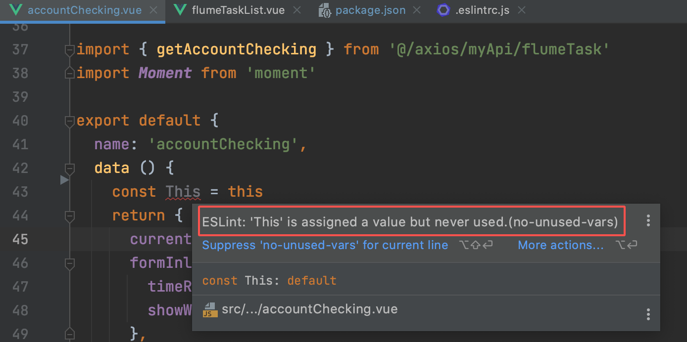

1. 是什么？
   1. 一个 npm 包，可以对代码风格和基础语法作检查，实时报错提示
2. 好处
   1. 解决代码风格不统一的问题
   2. 还可以检测到一些基础语法错误

## 先看效果



以这个为例，在代码中我们定义了一个 This 的常量，但是在代码中并没有使用到它，这是违反 eslint 规则的，因此这里马上就被 IDE 识别出来并且标红提示。平时使用过 eslint 的小伙伴应该知道，如果是一些小问题（例如**字符串**应该用单引号而不是双引号）这种问题，在保存代码时可以被 auto fix 掉，但是上面例子的这个问题，因为涉及到一个变量/常量，eslint 是不会擅自将其删掉来修改这个问题的。所以如果我们使用 `eslint --fix` 修复的话，eslint 会报错让我们自行修改。我们可以利用这个错误，来防止没有通过 eslint 的代码被 commit。

**总结一下： 在我们提交代码时，先自动使用 eslint 检查代码，并自动修复错误，在修复不了的时候，报错给我们。并且报错后此次的 commit 不会提交。**

下面来看看如何进行配置。

## 使用到的工具

- husky。一个 git 钩子工具，在这个需求中我们主要使用到了 pre-commit 钩子。通俗点来说，就是 husky 可以在你 commit 之前帮你做一些事情。
- eslint。代码检查工具，负责代码的错误检查与修复。
- lint-staged。在你**提交的文件**中，执行自定义的指令。（如果不想每次都检查目录下的所有文件，用这个准没错 😋）

## 安装

安装 husky，lint-staged

```
npm i -D husky lint-staged pretty-quick
```

## husky 钩子 pre-commit 配置

在 package.json 中：

```json
"husky": {
    "hooks": {
     	.......
      "pre-commit": "lint-staged"  // pre-commit，提交前的钩子
    }
  },
  "lint-staged": {
    // 此处可以配置文件夹和文件类型的范围
    "src/**/*.{js,vue}": [
      "eslint --fix",  // 先使用 eslint 进行自动修复
      "git add"  // 通过的话执行 git
    ]
  }
```

husky 会在你提交前，调用 pre-commit 钩子，执行 lint-staged，用 eslint 的规则进行检查，如果有不符合规则且无法自动修复的，就会停止此次提交。如果都通过了就会将代码添加到 stage，然后 commit。
