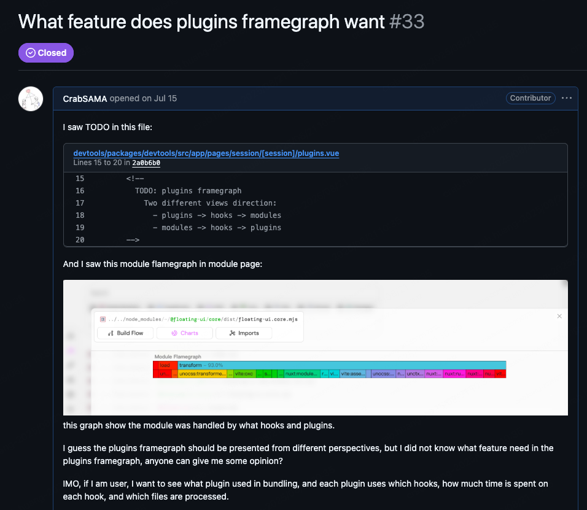
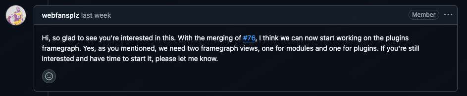
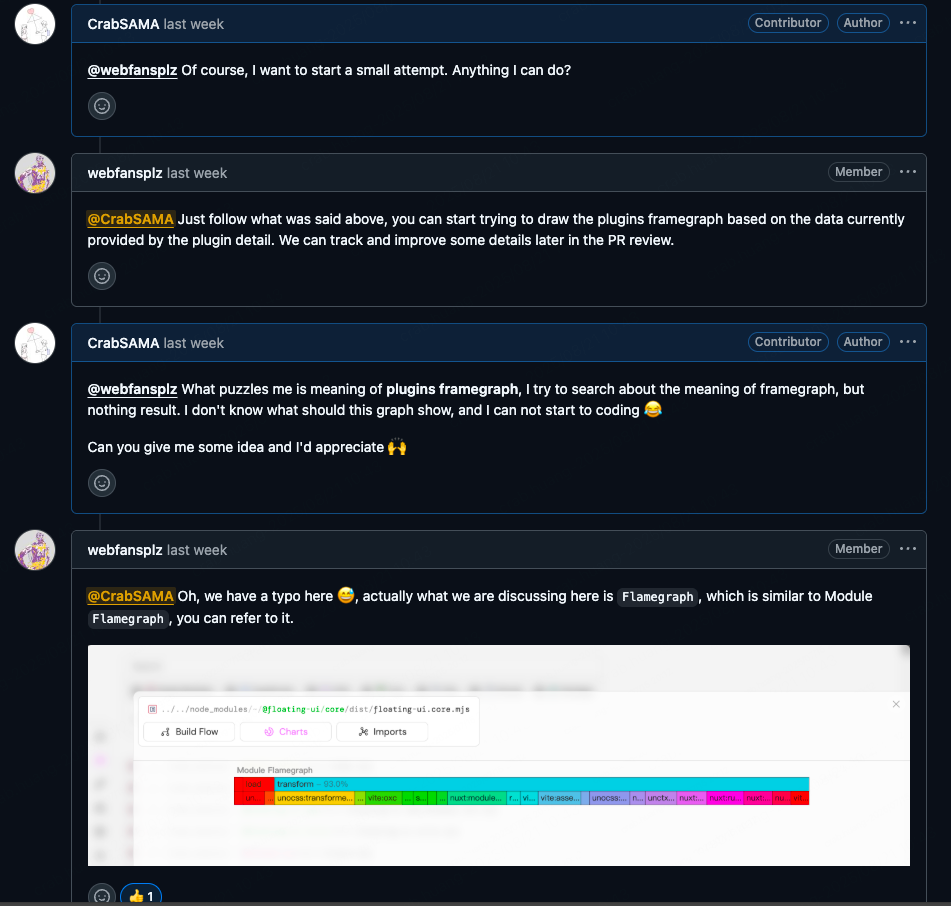
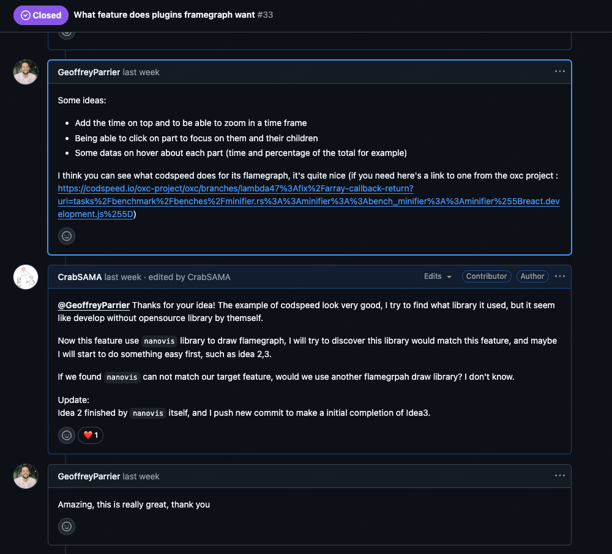
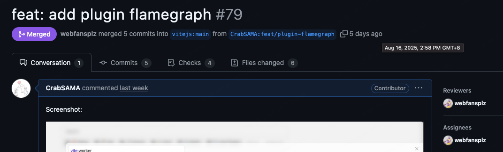
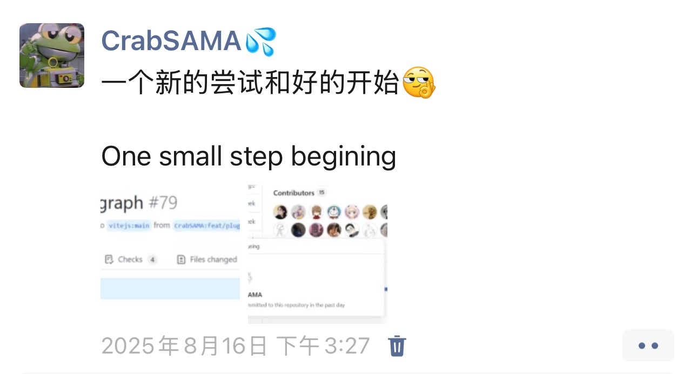

# 开源初体验

在参加完 Vue Conf 25 后，跟大佬们一通交流，当时又燃起了参加开源的想法，加上得到了和一位社区同学 Little Sound 的交流，了解到了开源对于普通开发者来说也不是那么的遥不可及，我就在想，要不我也开始试试吧？

正好当天最后一个主题是我偶像 antfu 大佬的 `vitejs/devtools` 分享，大佬在演讲完成后当场将库开源，我也是急匆匆地点上了 star，在后面的一个开发工作中，我遇到了一些 vite 打包的性能优化问题，我就想起来这个 devtools，想看看能不能帮上忙，结果发现其实这个项目还在 WIP，这下是真的一个好机会了，我也就在这里面找到了一些 TODO，开始尝试做贡献。我找到的这个 TODO 是给 devtool 中的 plugin 视图加上 flamegraph，即火焰图。

作为一个开源小白，心情还是有点忐忑的，担心自己做得不好，会被社区的大佬嫌弃，因此我就连写下第一行代码都有点难。平时在工作中我经常是承接产品的需求，根据产品文档和原型去做开发，在开源社区可能就只有一个简单的 TODO 描述，要怎么实现，里面有什么功能，能否引用第三方库还是自己造轮子，这都是未知的。

我首先是提了一个 issue，想了解一下团队对这个功能的想法：

这个过程也是挺忐忑的，我在 7.15 提交的 issue，过了一天没有人回复，过了一周没有人回复，过了两周没有人回复……

Well，初次接触开源的我就像追女孩子一样，既期待又害怕，就像给心爱的女生发完小作文，把手机一锁屏丢一边不敢看，但又很期待有自己想要的回复 😂

正当我都快忘记我提了 issue 这件事的时候，8.12 终于有人回复我了（科比哥我的超人！）：

好，那就开冲，我在网上搜啊，搜什么叫 framegraph，结果搜出来一点和前端相关的信息都没有，那叫一个疑惑，没办法，我还是厚着脸皮继续问社区的大佬：

😅 原来是拼写错误吗，哈基 github，你这家伙

到这个时候，我也算是了解了这个需求是要做什么：在 devtool 中，会通过不同的维度去查看构建过程的一些指标，比如可以查看某个具体产物构建时经过了哪些步骤，使用了哪些插件，这是其中的一个维度；同时我们也可以从插件维度出发，查看这个插件处理了哪些文件，在处理某个文件的时候花费了多少时间，这就是另外的一个维度。而 plugin 的 flamegraph 就是用火焰图的方式从插件的维度查看某一个插件的钩子以及处理文件的耗时情况。

了解之后就开干，开发的时候要注意项目用的技术框架与已有的库，尽量避免重复造轮子，比如这个项目中就用了 antfu 大佬写的 `nanovis` 库来进行图表的展示，那我们这边直接用就可以了。在做的过程中，实现完了基础的需求后，正如 Little Sound 交流的时候所说，当你对项目逐步了解之后，就有可能会有自己的一些见解，比如这个需求我就想到可以再根据插件处理的文件类型（Vue、TypeScript、npm 包等）进行分类，这个也是有现成的数据，因此我就直接一起实现了，想到实现了自己想到的额外的内容，也是挺让人自豪的，虽然只是一个很小的点。

在做的过程中，社区也会一起交流有什么新的 idea 或者可以改进的地方，比如这个大佬也给我提供了一些新的思路，是不是可以在火焰图上展示更多的信息，比如这个插件处理的过程中 CPU 和内存占用等，可以给到用户直观判断是否出现了性能问题。但我看目前 rolldown 并没有这块的数据采集，这个可以看看后面是不是需要给 rolldown 提 issue 看看社区的意见。

好的~几天后的周六，这个代码终于被 merged 到主分支上了，我的第一个正式的 PR 被合并成功啦（其实之前也有一次 PR，是给 axios 文档做翻译，不过这次是真实应用的代码，还是不太一样的）！这也是我在开源这一块的一个好的开始，我也有点激动地发了条朋友圈，虽然在外人看起来可能有点装逼，但是确实这个对我自己来说是一个值得纪念的事情。

## 总结

这个事情已经过去一周了，但想起来还是挺激动的，目前我也已经给 `vite/devtools` 提了 3 个 pr 都被 merged 进去啦~开源小白也在努力进步中 💪🏻

但不得不提的是，在我最近提完一个给 table 重构添加虚拟滚动的 pr 里，没有测试好所有的 case，也引入了一些小 bug，幸好有大佬及时帮我修复了（这里提一嘴，这个大佬是良米，是一个初中生，在 Vue Conf 上就见到的一个社牛，拿着 pocket 3 猛猛跟国外友人全英社交，不得不感慨真的是年少有为，人家初中开始做开源，我初中还在打游戏写外挂 😂）。总的来说，在贡献时可以大胆地去接需求，仔细认真地去做，做完结合保证充分的自测，胆大心细，对开源有兴趣的小伙伴都可以尝试参与其中。

同时做的过程中也有一些自己的小焦虑，比如有些时候会因为工作忙就没去关注贡献，就会有一些小愧疚感，但这个时候就会想起当时 Little Sound 说的，开源这个事情就是很自由的，可以选择自己适合的内容、在适合的时间、去做适合的事情，这段分享我在这里也分享给看到这篇文章的大家。

另外要提的是，针对不同的项目会有不一样的工作模式，比如最近在工作中用到的 dify 平台，它的开源社区建议是先提 issue，在社区讨论后再去提交代码与 pr，如果直接提 pr 有可能会由于这个 feature 不被通过而浪费时间，这个开发模式就不太一样，因此在尝试给新的项目贡献的时候，要仔细阅读项目中的 contribution 文档，根据规则来做贡献。

最后的最后，感谢 antfu 大佬，你是我的目标和偶像，你做的库确实好用，也是在你的项目中我开始了开源的一小步；感谢科比哥，正如 Vue Conf 上很多人说 sxzz 是他们开源的第一个老师，你在我第一步踏出时给了我许多帮助，也让我永远记住了这个 typo 的趣事 😄。

希望后面可以继续努力，继续参与到自己喜欢的项目中，做自己擅长且喜欢的事情确实很有成就感。
