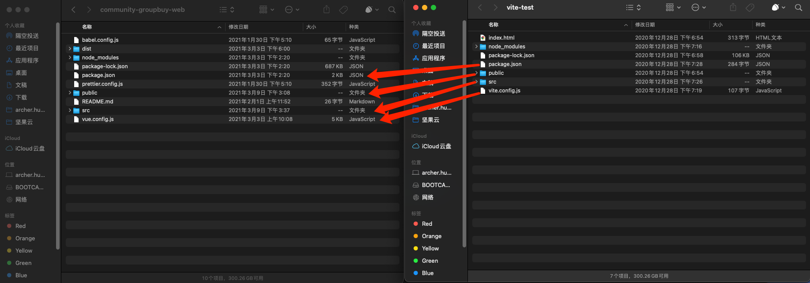
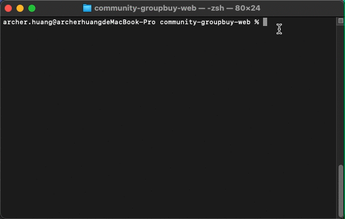

> `Vite1`仅仅试用过，`Vite2`已经更新了，全新插件架构，丝滑的开发体验，和`Vue3`的完美结合。 出于对尤大的信任与新技术的追求，在做毕设的我尝试着把项目移植到 Vite2 上。
>
> [Vite2官方文档](https://cn.vitejs.dev/)（看了一个星期的英文文档才发现原来中文文档也更新了 T.T）

## 目标

- 项目能移植到 Vite2 上正常运行，并且不存在影响运行的 bug
- 测试现有引入框架能否正常运行，不能正常运行有没有替代方案
- 分析 Vite2 的变化，如果项目使用 Vite2 有什么注意事项

## 从零开始搭建一个 Vite2 项目

```bash
npm init @vitejs/app
cd project
npm install
npm run dev
```

就这一行，简单粗暴，执行完后会让你选择对应的模板，Vite2 支持不同的框架，本文选择 Vue 即可。

一般通过脚手架初始化的 Vite 项目会在 `package.json`中添加 Vite 相关的 script，如果没有自己配置一下即可。

```json
{
  "scripts": {
    "dev": "vite", // 启动开发服务器
    "build": "vite build", // 为生产环境构建产物
    "serve": "vite preview" // 本地预览生产构建产物
  }
}
```

可以指定额外的命令行选项，如 `--port` 或 `--https`。运行 `npx vite --help` 获得完整的命令行选项列表。

## 移植现有项目（本文重点）

上面介绍了如何搭建一个全新的 Vite2 项目，但从我个人经验而言，现在由于 Vite2 刚发布，社区里关于如何移植现有项目到 Vite2 的例子是比较少的，以至于我找了好久也只找到了[一篇文章](https://www.vue-js.com/topic/6035bc2996b2cb0032c389de)（还是个卖课的就离谱）。但也感谢这篇文章给了我一些启发，现在就让我们开始吧~

由于官方现在还没给出完整的移植教程，我选用的方法是：

1. 新建一个 Vite2 + Vue 项目
2. 将现有项目代码迁移到该项目中
3. 根据报错一步一步进行调整



<p style="text-align: center;">左：VueCli4 项目 右：Vite2 + Vue 项目</p> 

### 迁移项目代码

根据对两个项目的结构进行对比，可以发现的是我们需要将 `src`, `public` ,`package.json`, `.config.js` 这些目录与文件进行迁移。

- src：直接复制粘贴即可
- public：将里面的 `index.html` 复制到 Vite 项目的根目录，其余复制粘贴即可
- package.json：复制粘贴所有的 `dependencies`，`devDependencies`中除去 `webpack`,`vuecli`相关的依赖，其余复制粘贴即可（包括你需要用到的预处理器等）
- vue.config.js：这个是大头，需要注意，下面单独开一个小标题进行描述。

#### `package.json`

```json
{
  "scripts": {
    "serve": "vue-cli-service serve",
    "dev": "vue-cli-service serve",
    "build": "vue-cli-service build"
  }
}
```

↓

```json
{
  "scripts": {
    "serve": "vite",
    "dev": "vite",
    "build": "vite build",
    "preview": "vite preview",
  }
}
```

#### `vue.config.js` -> vite.config.js

新建完项目后我们会得到一个清爽的配置文件：

```js
import { defineConfig } from 'vite'
import vue from '@vitejs/plugin-vue'

// https://vitejs.dev/config/
export default defineConfig({
  plugins: [vue()]
})
```

现在让我们来开个分屏，对比一下 `vue.config.js`与`vite.config.js`的区别。


很多是不是？看着就让人头大。但我们一步一步来，这个也不会太难。

1. 需要明确的是，`vue.config.js`与`vite.config.js`一样，可以使用 `require` 引用 `path` 等模块。

2. 首先，上方的依赖我们可以按需迁移过来，但与 `webpack` 相关的依赖、代码就不需要了。

3. 把目光转移到导出的配置对象上，这里有几个一一对应的选项可以进行迁移：

   - publicPath -> base
   - assetsDir -> build.assetsDir
   - outputDir -> build.outDir
   - css.loaderOptions -> css.preprocessorOptions（本项目用的 antd-vue，因此使用的是 less）
   - css.loaderOptions.less.lessOptions ->css.preprocessorOptions.less

   上面就是我项目里面需要迁移的配置项，其余的大家可以自行配置，比如 devServer 的端口号等等配置。

   还是那句话，与 `webpack` 相关的，比如 `configWebpack`, `chainWebpack` 就不需要迁移了。

4. 别名通过 `resolve.alias` 进行配置即可

   ```js
   resolve: {
     alias: {
       '@': path.resolve(__dirname, 'src'),
       '*': resolve('')
     }
   }
   ```

由于我的项目并不是十分大型的项目，所以在完成上述操作后基本上已经将配置文件迁移好了。（我觉得应该也没有人会将大型项目移植到一个并不成熟的新框架上吧😹）

### 调整代码

由于 `Vite2` 使用了原生 ES Module 的方法来服务源码，在项目中有几个大点需要改动：

#### 不能在代码中使用 `require` 和 `module.export`

由于脱离了 `webpack` 环境，`Vite2` 将代码直接托管至浏览器，因此我们不能在代码中使用 nodejs 的 `require` 和 `module.export` 来进行模块的导出导入了。取而代之的是，将代码中有用到的地方改成原生 ES Module 方式。

- `require('module')` -> `import * from 'module'`
- `module.export` -> `export { xx }, export default xx`

#### 尽可能地在 import 时将文件后缀补全

感觉之前是 `webpack` 对后缀进行了补全，才让我们可以使用 `import someComponent from '@/views/someComponent'` 这种格式引入 `@/views/someComponent/index.vue`的文件。但在 Vite 中似乎没有了这种处理，因此我们在引用 `.vue` 文件时，后缀名不能省略。一般 `Vite` 报找不到文件的错误，可以首要考虑这个问题。

#### `path`等 nodejs 原生模块不能使用

由于脱离了 `webpack` 环境，在项目代码中不可以直接使用 `const path = require('path')`的方式来使用 `path` 等模块了，会报 `Module "path" has been externalized for browser compatibility and cannot be accessed in client code.`的错误。不过在现有项目中还是有很多地方用到 `path` 的，因此我的解决方案是通过 [`path-browserify`](https://www.npmjs.com/package/path-browserify)来解决，安装了该包后，将项目中用到 `path` 的地方换成 `import path from 'path-browserify'` 即可。

### 完成

在修改完上述问题后，可以重启一下 `Vite` 的服务器，看看效果，一般不会出现特别大的问题。这也是 `Vite2` 做得比较好的地方，方便用户可以比较轻松地迁移~

<p style="text-align: center;"></p> 

来看一下运行效果，相较于 `VueCli`，确实现在是秒开，HMR也十分快！

## 踩坑点

### 错误提示有待提升

相比于 `VueCli`，`Vite`的错误提示并不是十分友好，有些时候页面也不报错，控制台也不报错。这种情况可以针对上面提到的点，在代码中打断点调试一下。有可能在一些 utils 中使用了某些不支持的语法，但得益于 js “强大的”的错误兜底机制，错误并没有被捕获到，可以在一些有疑问的地方加个 try-catch 块看看。

### Webpack 分包打包

配置 `build.rollupOptions.output.manualChunks` 属性即可。

```typescript
// vite.config.js
export default defineConfig({
  build: {
    rollupOptions: {
      output: {
        manualChunks(id) {
          if (id.includes('echarts')) {
            return 'echarts'
          } else if (id.includes('ant-design-vue')) {
            return 'ant-design-vue'
          } else if (id.includes('node_modules')) {
            return 'vendor'
          }
        }
      }
    }
  }
})
```

### HtmlTemplatePlugin 移植

安装 `vite-plugin-html-template` 插件，[NPM地址](https://www.npmjs.com/package/vite-plugin-html-template)

```typescript
// vite.config.js
export default defineConfig({
  plugins: [
    htmlTemplate({
      data: {
        title: '云台'
      }
    })
  ]
})

```

使用 EJS 语法（[文档](https://ejs.bootcss.com/#docs)）写 template 即可，在 htmlTemplate Plugin 中导出的值会自动输出到 html 文件中。

```html
<!DOCTYPE html>
<html lang="">
  <head>
    <meta charset="utf-8" />
    <meta http-equiv="X-UA-Compatible" content="IE=edge" />
    <meta name="viewport" content="width=device-width,initial-scale=1.0" />
    <link rel="icon" href="/favicon.ico" />
    <title><%= title %></title>
  </head>
  <body>
    <noscript>
      <strong
        >We're sorry but <%= title %> doesn't work properly without JavaScript enabled. Please
        enable it to continue.</strong
      >
    </noscript>
    <div id="app"></div>
  </body>
</html>
```

### 组件库按需引入（替代`babel-plugin-import`）

安装 `unplugin-vue-components` 插件，[NPM地址](https://www.npmjs.com/package/unplugin-vue-components)

以 `ant-design-vue` 为例，配置如下：

```typescript
// vite.config.js
import Components from 'unplugin-vue-components/vite'
import { AntDesignVueResolver } from 'unplugin-vue-components/resolvers'

// your plugin installation
Components({
  resolvers: [
    AntDesignVueResolver()
  ]
})
```

配置完成后如果没有其他需求，即可享受开箱即用的按需引入方式，插件会帮忙进行自动转化。

#### 如果你有配置主题的需求

你会发现使用这个插件之后，配置的主题是失效的。我们需要在配置中添加以下属性，使引入的样式文件是 `less` 文件，实现主题配置。

```typescript
// your plugin installation
Components({
  resolvers: [
    AntDesignVueResolver({
      // 引入 less 样式文件 而不是编译后的 css
      importStyle: 'less'
    })
  ]
})
```

### `require.context`批量引入

由于没有了 `node` 环境，因此 `require.context` 在代码中也不能使用了，`Vite` 官方提供的一个替代方法是 `import.meta.glob`。（[文档](https://cn.vitejs.dev/guide/features.html#glob-import)）

这里有一个题外话，如果项目中有使用 `typescript` 的话，会发现 `import.meta.glob` 会报 `import 上找不到 meta 属性`，解决方法也很简单，在 `tsconfig.json` 文件中的 `types` 属性中插入 `"vite/client"` 这一项即可。

下面是一个批量引入某个文件夹中所有 Vue 组件的例子：

```typescript
// require.context 写法
const context = require.context('./', true, /\.vue$/)

const components = {}

context.keys().forEach((key) => {
  const component = context(key).default
  components[key.replace('./', '').replace('.vue', '')] = component
})

export default components
```

```typescript
// import.meta.glob 写法
const context = import.meta.globEager('./*.vue')

const components = {}

for (const key in context) {
  components[key.replace('./', '').replace('.vue', '')] = context[key].default
}

export default components
```

### `require`引入静态文件

在项目中时常有通过 `require` 引入静态文件（如图片、js文件等）的需求，在没有了 `node` 环境后，`require` 不能用了，`Vite` 提供了新的静态资源处理方法。（[文档](https://cn.vitejs.dev/guide/assets.html)）

这里举一个引入 js 文件的例子，其他情况可以参考文档：

```typescript
// require 写法
let MyIconFont = createFromIconfontCN({
  // scriptUrl: '//at.alicdn.com/t/font_2827954_m2dc4k98x4b.js'
  scriptUrl: require('/public/iconfont.js')
})
```

```typescript
// Vite import 写法
import iconfontJs from '@/assets/iconfont.js?url'
let MyIconFont = createFromIconfontCN({
  scriptUrl: iconfontJs
})
```

### `tailwindcss` 样式优先级低

虽然感觉不是 `Vite` 的问题，但是 `Webpack` 下正常，`Vite` 中 `tailwindcss` 样式优先级就低于组件库的样式了，权当是 `Vite` 中的一个坑处理吧~

解决方法也很简单，在**高于3.0**的 `tailwindcss` 中，在 `tailwindcss.config.js` 文件中新增一个 `important: '#app'` 即可。具体内部实现就是 `tailwindcss` 在生成 css 时，每一个属性前面添加了一个 `#app` 选择器，又因为 id 选择器的高优先级，使得 `tailwindcss` 的样式拥有了较高的优先级。（[文档](https://tailwindcss.com/docs/configuration#important)）

### 使用按需引入时一直报 `find new dependency`

安装 `vite-plugin-optimize-persist` 和 `vite-plugin-package-config` 两个插件，并引入：

```javascript
// vite.config.js
import OptimizationPersist from 'vite-plugin-optimize-persist'
import PkgConfig from 'vite-plugin-package-config'

// your plugin installation
plugins: [
  PkgConfig(),
  OptimizationPersist()
]
```

这个插件实现的功能是在每次找到新的依赖时，将其添加到 `Vite` 配置中的 `optimizeDeps.include` 属性，以保证第二次访问时 `Vite` 不会再重新编译为 `ES Module`。

> 2022年04月13日更新：
>
> 在 `Vite` 更新到 `2.9.1` 后，上述问题解决，可以不用引入这两个插件了，作者仓库也标注归档了。
>
> 在第一次启动项目或删除 `node_modules` 时，会对依赖进行预构建；在进入新页面时按需引入了新组件，也会对依赖进行预构建，构建完成后将会自动刷新页面，属于正常现象。

### 分包后打包，preview 报错

`vite preview` 时报错：`Uncaught TypeError: Cannot read properties of undefined (reading 'prototype')`

经查看后怀疑是 `ant-design-vue` 版本的问题，更新了 `ant-design-vue` 到最新版本后，出现新的错误：`Cannot access 'isFunction' before initialization`

因为 `isFunction` 是 `@vue/core` 中内置的方法，猜测是**分包**导致的问题，后续尝试将 `vite.config.ts` 中的 `build` 选项中分包相关的配置清空，这个问题告一段落。

### 引用的包中 `esm` 与 `commonjs` 语法混用，报错

由于系统使用了我自己开发的一个 `npm` 包，里面有部分代码是直接引用第三方组件的，其中还有 `commonjs` 的 `require` 语法，因此进入系统时就会报错：`ReferenceError: require is not defined`。

查询资料后得知 `rollup` 有个 `@rollup/plugin-commonjs` 的插件，可以解决这个问题，只需要在 `vite.config.ts` 中设置 `build.commonjsOptions.transformMixedEsModules: true` 即可，但是在这样设置后我这边依旧会报错：`Uncaught ReferenceError: exports is not defined`。

最后由于这个包是我自己开发的，我在这个包的 `rollup` 打包配置中引入了 `@rollup/plugin-commonjs` 并配置 `transformMixedEsModules: true`，将打包出来的 `require` 转成 `esm` 的 `import` 用法，然后去除上面的 `build.commonjsOptions.transformMixedEsModules: true` ，报错解除，可以正常进入页面了。

### 资源用 `cdn` 引入，报错 `Uncaught TypeError: Failed to resolve module specifier “echarts”. Relative references must start with either “/”, “./”, or “…/”.`

仍未解决，TODO~

### 打包时出现 `warning: "@charset" must be the first rule in the file` 警告

要么就在 `vite.config.ts` 中加入 `postcssPlugin: 'internal:charset-removal’`，但是 `vite` 将不再去获取 `postcss.config.js` 中的配置，会丢失 `tailwindcss`，这个具体要研究 `postcss.config.js` 怎么配置才能达到效果。

更新：

```javascript
// postcss.config.js
module.exports = {
  plugins: [
    {
      postcssPlugin: 'internal:charset-removal',
      AtRule: {
        charset: (atRule) => {
          if (atRule.name === 'charset') {
            atRule.remove()
          }
        }
      }
    },
    require('tailwindcss'),
    require('autoprefixer')
  ]
}

```

