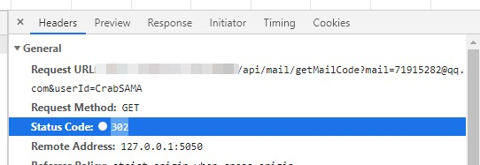
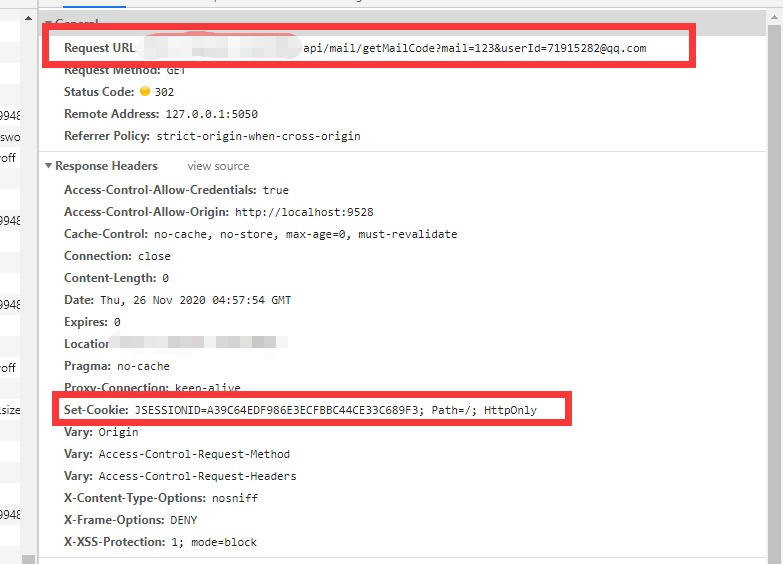

## 前提

前端使用 `Vue` 搭建，后端使用 `springboot` + `spring security`，各自分离部署，这是前提。

## 问题

在一天中午，某位测试同学丢过来一个缺陷，**说这边登出后重新访问注册、找回密码等接口会报错，但是第二次就访问成功了**。这个还是挺出奇的，毕竟没有遇到过相关的问题，马上上系统查看问题。

首先自己根据测试同学给出来的复现步骤（登录-登出-调用注册、找回密码等接口）执行了一遍，打开F12，看到了一个奇怪的报错——`302`？！

好家伙，第一次见到访问接口会报 `302` 的，真是惊奇……首先考虑到这个是后端问题，先让后端小伙伴去找一下日志，但是并没有发现什么问题。因为这个接口是设定了不被 `security` 拦截的，所以首先会考虑到是不是 `security` 配置出了问题，但是经过排查好像也没什么异常的样子，所以对于前端来说，我先从 `http request` 这方面去找问题。

这是我发现的第一处异常，为什么对于非登录接口来说，会在响应头带上 `Set-Cookie` 字段？这不是应该登录成功后做的事情嘛。查看了请求头，发现在调用了登出接口之后，**第一次请求**还是会带上 `JSESSIONID`（后端登录成功后回传的 `sessionId`）的 `cookie` 访问接口，但是第二次请求就会带上 `302` `Set` 的 `Cookie`，然后访问成功。真是令人迷惑的地方。还有一处异常就是，查看了重定向所用的 `Location` 字段，发现重定向到了后端的根地址。

既然遇到问题了，首先我们就要面向百度编程，在百度搜索了关键字 `spring security 302` 之后，发现这个重定向好像是一个普遍的问题，但是和我们这次遇到的问题不一样。直到我看到了一篇 `Stack Overflow` 的文章后，说 `security` 的配置中有一个 **`invalid-session-redirect`** 的属性会导致重定向（因为 `302` 状态码的意思就是临时重定向），突然就想到这个好像与我们这次的问题有关。因为一般这个属性是用在后端验证 `session` 时发现传值不正确或者 `session` 不存在的时候实现重定向，在以前前后端不分家的时候，后端兼顾前端渲染的场景下就十分实用。但是在如今前后端分离的情况下，一般是由前端根据后端返回的值来进行路由跳转，所以这个就比较少用到了（在 `vue` history 模式下应该还是可以用的）。在后端去除了这一行配置后，发现问题已经解决了。

##  复盘

在解决了问题后，我进行了一次复盘，总结了一下这次问题出现的原因：在前端第一次登录成功时，后端建立一个 `session`，并返回对应的 `sessionID` 给前端，以 `Set-Cookie` 的方式存放。在登出时，后端会将对应的 `session` 清除，但是前端的 `Cookie` 还没有失效，因此在访问对应域下的接口时，还是会带上 `sessionID`。好嘛，后端这下根据收到的 `sessionID`，找不到对应的 `session`，因此就触发了 `invalid-session-redirect` 的配置，命令跳转到设定的路径，因此导致触发了 `302` 重定向。要解决问题，一是去除重定向；二是保留重定向，但是在登出的时候也将 `sessionID` 清除掉，保证下次请求不会带上不存在的 `sessionID`。但是这里又引申出一个问题：**为什么对于不拦截的接口，也会去验证对应的** **`sessionID`** **呢？**这个问题我个人猜测是 `security` 的机制，因为我也没有系统学习过后端，只是我的一些拙见。在本次项目中，我们使用了第一种方法，但这不代表第二种方法是不可行的，我们尝试过，由于后端设定的 `Cookie` 属性中有 `HttpOnly`，因此前端是无法消除 `Cookie` 的，必须要后端来清除，而后端清除 `Cookie`，一般使用 `SetMaxAge` 为 0 来实现，不知道这样可不可以呢？我们还没有尝试过，也是值得了解的一个点。

> 2021-01-15 10:40:35更新：使用 `node.js` + `egg.js` 测试过，登出时 `SetMaxAge` 为 0 可以实现清除 `cookie` 的需求

经历过这次的问题，使得我一个前端会以后端的思维去想问题，对 `session` 与 `cookie` 有了进一步的了解，也是一次难忘的踩坑经历。