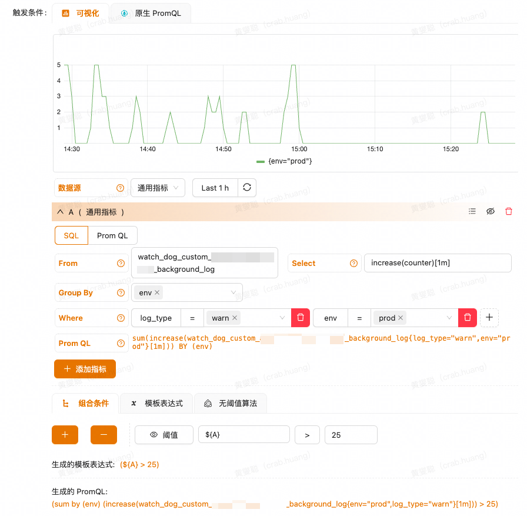

# 前端日志收集、上报及告警

## 背景

公司内部的日志系统使用的是 ELK 框架，即 ElasticSearch、Logstash 和 Kibana 三个开源组件结合使用，完成更强大的用户对日志的查询、排序、统计需求。一般这套框架上还会使用 Filebeat 这个组件用于监控日志的变化，并传给 Logstash 这个管道。

流程是：Filebeat 监控日志变化并收集日志，通过 Logstash 这个管道上报到 ElasticSearch 中，最终通过 Kibana 展示 ElasticSearch 中的数据。

我这边是**前端开发**，因此需要关注的点主要在日志的收集与上报这块，这一块是和后端不一样的，后端使用了公司集成的开发框架即可实现开箱即用的日志上报功能。前端侧这边在公司的大前端部门也有提供对应的日志与埋点上报 SDK `watchdog`。

本质上的流程和上面 ELK 框架是一样的，只是将 Logstash 的部分换成自研上报，自己处理日志的收集与上报。

在了解了日志系统的底层架构后，我们转向其上层应用实现，即抛出问题：如何实现前端侧的日志收集、上报及告警？

## 日志收集

首先第一步是日志的收集，前端侧的日志基本都是通过 `console` 这个对象下面的方法打印出来的，最常用的就是 `console.log`。

参考其他语言的日志框架设计，如 `log4j` 等成熟的日志框架，他们都提供了丰富的预置功能，比如将日志等级分类、提供统一前缀等功能。在最小成本实现的想法下，我初步打算为日志的输出添加一个时间前缀，同时使得日志可方便的上报。

要做到这种效果，自然就需要我们对 `console` 这个对象进行一些处理，我们可以选择使用新建一个日志类，然后添加一些自己的方法并调用，这样是最灵活的。但在一个已经完善并线上运行的项目中，我的想法是尽量不改动原有代码，那么我们也可以通过 Proxy 对 `console` 对象进行代理，同时将原生的 `console` 对象用 proxy 后的对象替换掉，这样就可以实现不改动业务代码的情况下无痛接入。

实际代码实现如下：

```typescript
// 保存原始的 console 方法
const originalMethods = {
  info: console.info,
  log: console.log,
  warn: console.warn,
  error: console.error,
}

const proxyApplyHandler = (
  logType: LogType,
  target,
  thisArg,
  argumentsList
) => {
  // TODO 上报日志

  // 简单做法，日志打印时间戳
  Reflect.apply(target, console, [new Date().getTime(), ...argumentsList])
}

// 创建一个 Proxy 对象来代理每个方法，并在调用时执行额外逻辑
const proxiedConsole = {
  info: new Proxy(originalMethods.info, {
    apply: (...args) => proxyApplyHandler('info', ...args),
  }),
  log: new Proxy(originalMethods.log, {
    apply: (...args) => proxyApplyHandler('log', ...args),
  }),
  warn: new Proxy(originalMethods.warn, {
    apply: (...args) => proxyApplyHandler('warn', ...args),
  }),
  error: new Proxy(originalMethods.error, {
    apply: (...args) => proxyApplyHandler('error', ...args),
  }),
}

export default proxiedConsole
```

需要注意的是，**此处仅为基础实例，并没有对 `console` 下所有的方法都做处理，读者需要根据自己的需求进行抉择**。

## 日志上报

上面说完了日志收集，接下来就到了上报的部分。这一块已经被大前端组同学包装好了并提供了公共接口，我们只需要调用对应的接口即可。因此我们自己通过 `fetch` 封装了接口调用，并在上方 TODO 的地方中添加接口调用逻辑，即可实现日志上报。

但很可惜的是，这样我们就没办法了解到它内部的实现了。

因此我去查阅了一些资料，初步地了解了一下日志上报的流程。这块为作者自己的见解，有误之处敬请原谅。

日志上报在 ELK 框架中主要用到的组件有：Filebeat、Logstash 等，Filebeat 监控日志变化并收集日志，Logstash 它是帮助我们收集、解析和转换日志的。

后端产出日志一般都是通过框架直接产出 log 到文件中，那我们就可以使用 Filebeat 来收集日志。收集到的日志我们需要落库，平时落库我们是通过一些 HTTP 接口来实现的，在 ELK 中我们也有对应的框架 Logstash。

Logstash 的原理其实还比较简单，一个输入，一个输出，中间有个管道(不是必须的)，这个管道用来收集、解析和转换日志的。Logstash 运行时，会读取 Logstash 的配置文件，配置文件可以配置输入源、输出源、以及如何解析和转换的。

但是我们上报的都是原始日志，就是一行一行的日志内容，这样是不便于搜索与管理的，因此我们需要进一步去配置 Logstash，来告诉它要通过怎么样的方式来解析原始日志，一般解析完成后会使用 JSON 格式来描述一行日志，我们将这段 JSON 落到 ES 中，就可以更友好地进行日志的管理了。

因为本文属于经验之谈，具体如何配置等在此处就不展开了，在后续用到的时候我也会去深入了解。

## 告警

公司内的告警系统是基于 Prometheus 做的二次开发，因此我们也需要知道一些相关的知识才能配置好告警策略。

在使用 Prometheus 时，ES 就是其中的一个数据源，我们可以通过写一些 Prom QL 去统计一些指标，然后根据自己的要求，配置指标值满足一定条件时进行告警，这就是最基础的流程。

公司内部的告警系统提供了一些可视化的配置界面，可以让我们较为简单地通过 web 界面直接生成 Prom QL，因此在这里我会更倾向解释一下每个参数的意义，以方便自己去理解。



这是公司内部告警系统的一个配置页面，其实最终的产物也是 Prom QL。

首先我们需要配置 `From`，这个属性指的是指标值从何来，一般我们会有一个数据源，此处配置的就是数据源名称。

接下来要配置的就是一些**聚合条件**，我们可以将一系列的指标数据按照条件进行聚合，可能这个概念比较模糊，说人话就是在一段时间内有无数个日志点，这些点单拎出来是没统计价值的，但是我们可以去统计这一段时间内有多少个点，这样聚合之后，就可以将聚合后的值拿出来做判断，比如一段时间内有多少个报错，就算是异常情况，需要告警。

`Select` 这个选择框里面可以选的就是聚合函数，有几个比较常见的函数：

1. **sum/min/max/avg**: 基础的数值运算。
2. **rate/irate**: 每秒的增量值。

以上面配置为例：`sum(increase(counter)[1m])`，这个的意思就是统计一分钟内有多少次日志，即一分钟内有多少次异常，这就是很有价值的统计指标。

而下方的 `Group By` 和 `Where` 等条件，学过 SQL 语言的同学应该很清楚，就是一些筛选条件与聚合条件，这里就不做过多讲述了。

在配置好了之后，我们就会得到一条 Prom QL，通过这条 Prom QL 我们就可以在告警平台上配置告警了，一般我们都是配置一些阈值条件，比如大于多少次告警这样，具体的告警配置这里也不讲述了，因为每个公司的内部系统不一样，我们这里配置完成后可以通过飞书推送告警到人或者群。

---

假设公司没有做一些自己的二次开发，直接使用的是 Prometheus 和 Grafana 组件的话，在了解了上面 Prom QL 的组成后，也能通过自己的理解写出对应的 Prom QL，放到 Grafana 中即可实现简单的数据可视化与告警功能。综上所述，有自己的理解很重要~

## 总结

在写完这篇文章后，我对当前流行的日志框架 ELK 有了初步的了解，知道了日志收集、上报到应用的流程组成，同时结合了自己前端开发的经验知识，实现了前端侧的日志上报与收集，最后也学习了如何配置日志打点告警。这些知识有助于我后续对系统稳定性需求的实现提供支持。
