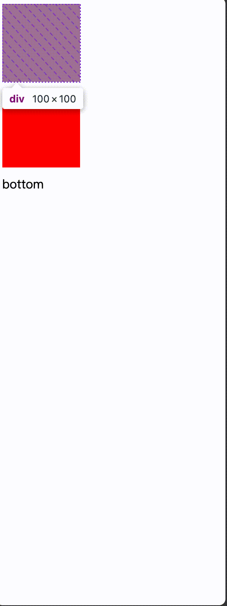
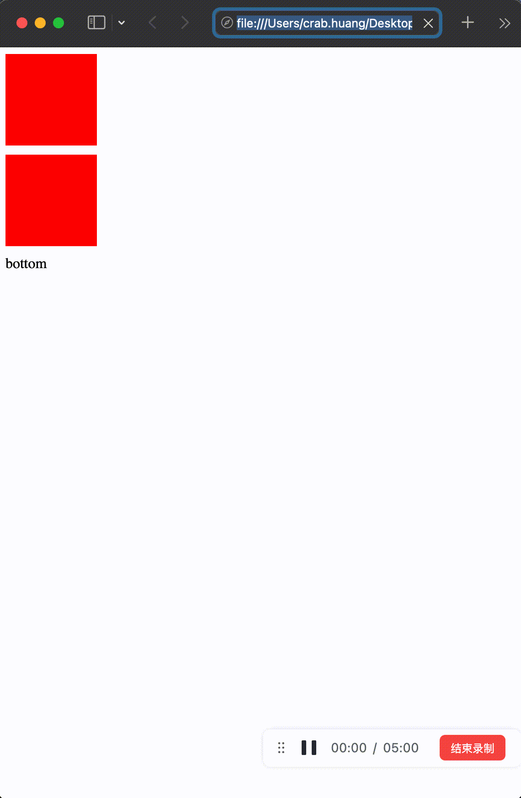

# 滚动锚定

## 背景

在我们开发过程中，有些时候会遇到容器内添加元素的需求，一般往下添加是没问题的，但是当我们有在运行过程中动态往上方添加元素时，就会发现不同浏览器有不同的行为。很常见的一种场景就是消息列表向上滚动加载的场景。

## 复现

这一段代码可以模拟这种case：

```html
<!DOCTYPE html>
<html lang="en">
<head>
  <meta charset="UTF-8">
  <meta name="viewport" content="width=device-width, initial-scale=1.0">
  <title>Document</title>
</head>
<body>
  <div id="container" style="display: flex; gap: 10px; flex-direction: column;">
    <div style="background: red; height: 100px; width: 100px;"></div>
    <div>bottom</div>
  </div>
  <script>
    const container = document.getElementById('container')
    setInterval(() => {
      const div = document.createElement('div')
      div.style.background = 'red'
      div.style.height = '100px'
      div.style.width = '100px'
      container.insertBefore(div, container.firstChild)
    }, 300)
  </script>
</body>
</html>
```

在 chrome 和 safari 中运行的情况是不一样的，我们在 chrome 中运行是这样的：



可以看到，运行很正常，当我们将界面滚动到底层的时候，在容器顶部添加元素时页面**滚动位置会保持不变**，这种情况下用户体验十分良好。

而在 safari 中，我们运行是这样的：



当我们滚动到容器底部，此时如果继续在容器顶部添加元素，我们会发现它**不会保留我们的滚动位置**，而是一直发生滚动位置跳动的情况，可以想象到用户在滚动完之后容器高度变化，滚动位置重新计算时会有多么崩溃，在这种情况下用户体验是不好的。

## 原因

这种现象我们有一个专用名词叫做「滚动锚定」。实现了滚动锚定的浏览器，例如 chrome 和 firefox 此类针对上面的这种情况，默认就会有滚动位置不变的效果，同时 css 中也有一个属性 `overflow-anchor` 用于控制浏览器滚动锚定行为。

在 2024 年，大多数浏览器都实现了这个规范，但这其中有一个新时代的 IE 在拖后腿，就是我们的 safari 同学。


因此在做 H5 开发的时候，由于我们需要适配移动端不同系统的浏览器，在 iOS 系统上运行此类代码就会出现行为不一致的问题，当遇到问题的时候我们就可以想到是滚动锚定导致的行为不一致。

此处也附上两个 webkit 的 issue，据说后续 webkit 会支持吧，但是我们现在还是要手动为它擦屁股。

https://bugs.webkit.org/show_bug.cgi?id=171099#c7

https://bugs.webkit.org/show_bug.cgi?id=259269

## 解决方法

解决方法也是有的，我们可以通过手动计算滚动高度，在插入文档后通过 `scrollTo()` 方法或者调整 `scrollHeight` 属性来重新设定滚动位置，让其保持原来的滚动位置，通过这种方式曲线救国实现一个假的滚动锚定效果。

```tsx
const distanceToBottom: number = (chatContainerRef.current && (chatContainerRef.current.scrollHeight - chatContainerRef.current.scrollTop - chatContainerRef.current.clientHeight)) || 0
      
fetchData((list) => {
  flushSetChatHistory((prev) => {
    return [...list, ...prev]
  })
  if (chatContainerRef.current) {
    chatContainerRef.current.scrollTop = chatContainerRef.current.scrollHeight - distanceToBottom - chatContainerRef.current.clientHeight
  }
})
```

这段代码是一段 react 的实现代码，通过 `chatContainerRef` 获取容器的 DOM 元素，在获取完数据后，通过 `flushSync` 设置渲染数据令 DOM 马上更新，然后重新正确的滚动位置来设置 `scrollTop` 保持滚动位置。

在 Vue 和 React 此类框架中我们都需要注意，要等待 DOM 更新完成后再设置滚动位置，否则也会出现计算位置不正确、滚动位置跳动的问题。