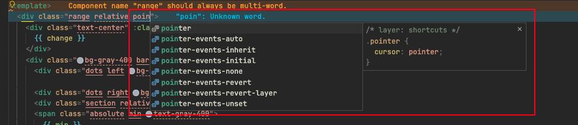

## @apply 指令

由于是 tailwindcss 切 unocss，其中有 @apply 指令还是挺好用的。在 unocss 这边，有两种实现方式：

1. 使用 `@unocss/transformer-directives` ，该方案仅支持 `Vite` 
2. 使用 `@unocss/postcss` ，该方案支持 `Webpack` 但需要安装 `postcss`

由于项目较大，目前暂时不考虑迁移 `Vite` ，因此只能采用 `postcss` 的方案来支持 `@apply`。

[https://unocss.dev/integrations/postcss](https://unocss.dev/integrations/postcss)

## Intellisense 语法提示

vscode 插件：[UnoCSS](https://marketplace.visualstudio.com/items?itemName=antfu.unocss)

### 语法提示不出现排查

1. vscode 输出切到 Unocss，清空打印内容，command/ctrl + shift + p，运行 reload Unocss，如出现下列内容则证明配置加载成功，如果提示其他内容则证明配置加载有问题，优先检查 `uno.config.js/ts` 配置是否正确。

   ```
   🔁 Reloading...
   🛠 Resolving config for /Users/xxx/Project/xxx
   🛠 New configuration loaded from
     - /Users/xxx/Project/xxx/uno.config.js
   ℹ️ 1 presets, 855 rules, 5 shortcuts, 45 variants, 0 transformers loaded
   ✅ Reloaded.
   ```

2. vscode 设置中，`Editor: Quick Suggestions` 设置 `"strings": "on"`

   ```json
   "editor.quickSuggestions": {
     "strings": "on"
   }
   ```

3. 写 class 属性时，输入前几个字母，如果有弹出如下图，则证明语法提示正常。

   

   同时，vscode 输出栏内 Unocss 会打印出如下内容：

   ```
   🤖 /Users/xxx/Project/xxx/src/views/xxx.vue | [pointer, pointer], [pointer-events-auto, pointer-events-auto], [pointer-events-inherit, pointer-events-inherit], [pointer-events-initial, pointer-events-initial], [pointer-events-none, pointer-events-none], [pointer-events-revert, pointer-events-revert], [pointer-events-revert-layer, pointer-events-revert-layer], [pointer-events-unset, pointer-events-unset]
   ```

   如果没出现这些内容，证明插件没有正常搜索，目前排查出 `tailwindcss` 和 `windicss` 插件会有冲突，在没有特殊情况时可以卸载前面的两个插件，单独使用 `Unocss` 即可。

   