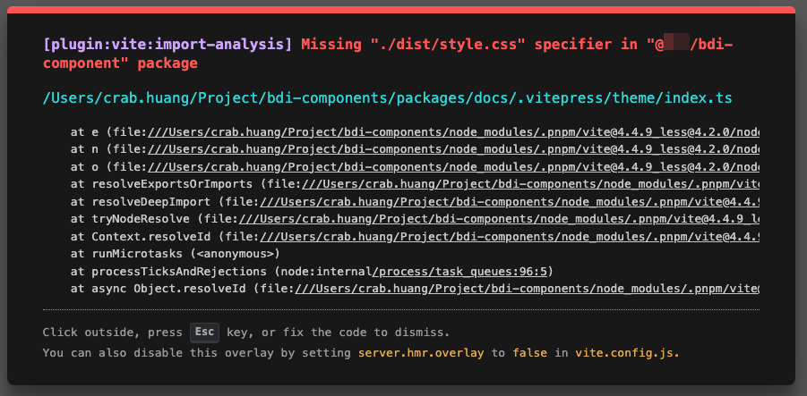

## 问题现象

在 `Vitepress` 中引入组件与样式时，报找不到路径的问题。

```vue
<script setup>
import { SearchUser } from '@***/bdi-component'
import '@***/bdi-component/dist/style.css'
</script>
```



## 原因

将错误内容在谷歌上搜索，搜到了一条类似的 [issue](https://github.com/vitejs/vite/issues/1505#issuecomment-758824346)，这里面提到了 package.json 内的一个属性：`exports`。这个属性会在 bundlers 和 Node.js 中被使用，用于寻找导出的内容，如果没有在 `exports` 中指定的内容，是不会被导出并被寻找到的。

检查当前项目的 package.json，发现确实定义了 `exports` 这个属性：

```json
{
  "name": "@***/bdi-component",
  "private": true,
  "version": "1.0.0-alpha.1",
  "type": "module",
  "main": "dist/cjs/index.js",
  "module": "dist/es/index.js",
  "exports": {
    ".": "./dist/es/index.js"
  },
  "types": "types/index.d.ts"
}
```

可以看到，这里 `.` 指向的是 `./dist/es/index.js`，因此直接 import 时会直接找到 dist 下面的构建产物，但由于 style 等文件没有被显式声明，因此我们没有办法通过路径引入包中的其他内容。

## 解决方法

`exports` 这个字段其实并不适用于我们这种场景，我们通过定义 `main` 、`module` 等字段就可以保证直接 import 找到对应的构建产物。因此我们将 `exports` 这个属性去掉，就可以正常运行了。
