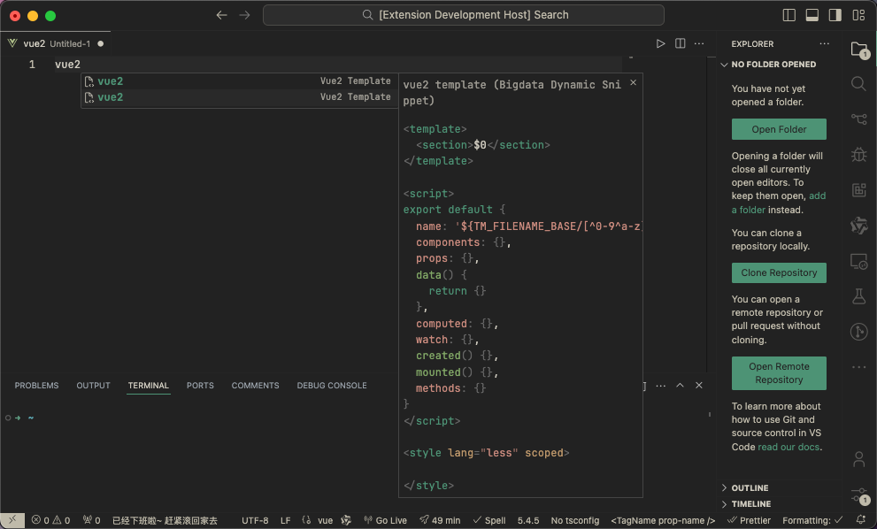

# VSCode Extension 动态 Snippets

## 背景

组内在搞前端工程化提效相关内容，VSCode 插件也属于其中的一部分，因此最近在学习如何写 VSCode 插件。

在阅读了官方的文档后，发现 VSCode 插件有许多可以支持的功能：

- 改变 VSCode 的外观
- 在 UI 中添加自定义组件和视图
- 使用 Webview 展示自定义的网页
- **支持新的编程语言**
- 支持特定的调试运行时
- ...

在上述功能中，我们一眼就看到了实际用于提效的功能，也就是对编程语言的功能扩展。这其中也包含了两个方向：Declarative language features（声明性语言功能）、Programmatic language features（编程语言功能）。前者是一些通过配置项实现的功能，后者是一些通过实际代码实现的逻辑，各有适用的场景。

用过 VSCode 的同学可能都知道代码片段（Code Snippets）的功能，这个功能允许我们通过一些简单的提示词来输入重复的代码，可以提升我们的开发效率。

因此我们先从简单的做起，尝试在 VSCode 中实现代码片段的功能。

## 问题

Snippet 功能一般是通过一个 JSON 配置文件来实现的，在 VSCode 插件中也一样，我们只需要将 JSON 的路径放到插件 `package.json` 下面的对应配置中即可将代码片段集成在插件中。这属于**声明性语言功能**中的一部分。

但部门内部讨论下来有一个问题，就是在每次更新代码片段时，我们需要更新 VSCode 插件才能生效。然而 VSCode 插件没有私服的概念，我们只能通过打包成 vsix 包的形式，交给各位用户去更新，没有办法实现自动更新的效果。这一块有对应的奇技淫巧解决，可以看这篇文章：[公司的私有 vscode 插件，如何自动更新（附带思路）](https://juejin.cn/post/7141662937420136479)。自动更新的问题虽然有办法解决，但是我们还是需要更新插件的代码，进行 git 操作，那能不能做到通过在线配置实现动态 Snippet 的功能呢？毕竟在我看来，代码片段本质上也是一段 JSON 配置。

## 解决过程

首先上一个结论：VSCode 官方并没有提供通过在线获取 JSON 配置后动态设置代码片段配置的功能。也就是说，不能像我想的那样，下载一段 JSON 串然后直接给到 VSCode 设置代码片段。

遇事不决再问问 GPT，没想到 GPT 居然给出了一个思路：通过 CompletionItemProvider 来曲线救国。VSCode 插件**编程语言功能**提供了 Auto Completion 的相关 API，通过注册 Provider 可以动态地提供一些代码选项。在我看来，VSCode 自带的代码片段功能的底层实现应该也是 Auto Completion，属于它的一个派生。因此我们直接使用它的父亲去实现这个功能也是合理的。

说干就干，结合 GPT 得到了一个最小实现：

````typescript
import * as vscode from 'vscode'
import http from 'node:http'

export default function dynamicSnippetProvider(
  context: vscode.ExtensionContext
) {
  // 提供 Vue 文件格式的功能
  context.subscriptions.push(snippetInit('vue'))
}

function snippetInit(language: string) {
  let snippetData: any
  // 通过 http 请求获取 json
  http
    .get(`http://localhost:3000/${language}.json`, (resp) => {
      let data = ''
      resp.on('data', (chunk) => {
        data += chunk
      })
      resp.on('end', () => {
        const json = JSON.parse(data)
        // 通过 json 数据初始化 CompletionItem 数组
        snippetData = json.map((item: any) => {
          const snippet = new vscode.CompletionItem(
            item.prefix,
            vscode.CompletionItemKind.Snippet
          )
          snippet.insertText = new vscode.SnippetString(item.body.join('\n'))
          snippet.documentation = new vscode.MarkdownString(
            item.description +
              '\n' +
              `\`\`\`${language}\n` +
              item.body.join('\n') +
              '\n```'
          )
          return snippet
        })
      })
    })
    .on('error', (err) => {
      console.error(err)
    })
  // 初始化一个 CompletionItemProvider，返回 CompletionItem 列表
  const provider = vscode.languages.registerCompletionItemProvider(
    language,
    {
      provideCompletionItems(document, position, token, context) {
        return snippetData
      },
    },
    '.'
  )
  return provider
}
````

整体代码逻辑就是通过请求获取到 snippet 类型的 JSON 数据，通过对其进行解析，变成 CompletionItemProvider 所需的 CompletionItem，然后注册到对应的语言下使用。

效果如下：


<center>CompletionItemProvider实现效果</center>


<center>代码片段效果</center>

实际体验下来，实现的效果是差不多的，但是可以看到相对原生的代码片段来说，没有代码高亮，还有一些样式上的区别。如果要抓这些细节的话，也可以去看看 VSCode 的源码，看看它是如何实现的。这一块我尝试过去看，但是并没找到相关的内容，因此就暂时放弃了。

实现下来应该也可以达到 80%的效果，因此也算在部门内部通过了，后续如果追求效果的话，也可以往这一块继续深入研究。

---

## 2024.5.11 更新

在研究了 VSCode 的源码后，找到了它的一些 API，如今可以实现到与原生代码片段一样了！



<center>实现效果</center>

代码如下：

```typescript
function snippetInit(language: string) {
  let snippetData: any

  http
    .get(`http://localhost:3000/${language}.json`, (resp) => {
      let data = ''
      resp.on('data', (chunk) => {
        data += chunk
      })
      resp.on('end', () => {
        const json: Record<string, SnippetData> = JSON.parse(data)
        snippetData = Object.entries(json).map(([key, item]) => {
          const snippet: vscode.CompletionItem = {
            label: {
              label: item.prefix,
              // 自动补全右侧的提示
              description: key,
            },
            // CompletionItem 类型 会影响 icon
            kind: vscode.CompletionItemKind.Snippet,
            insertText: new vscode.SnippetString(item.body.join('\n')),
            // header
            detail: item.description + ' (Bigdata Dynamic Snippet)',
            // 代码提示
            documentation: new vscode.MarkdownString().appendCodeblock(
              item.body.join('\n'),
              ''
            ),
          }

          return snippet
        })
        vscode.window.showInformationMessage(
          `${language} dynamic snippet loaded!`
        )
      })
    })
    .on('error', (err) => {
      console.error(err)
    })

  const provider = vscode.languages.registerCompletionItemProvider(
    language,
    {
      provideCompletionItems(document, position, token, context) {
        return snippetData
      },
    },
    '.'
  )
  return provider
}
```

阅读 VSCode 源码的方法：

- GPT 咨询：在 VSCode 源码中，代码片段功能的实现是在哪个文件中？在 VSCode 源码中，代码片段功能的 CompletionItem 的 documentation 代码在哪里？
- 关键词搜索：`Snippet`，`CompletionItem`，`SnippetString`，`MarkdownString`
- F12 查看元素类名（Help - Toggle Developer Tools），然后代码搜索到指定的元素，查看如何赋值
