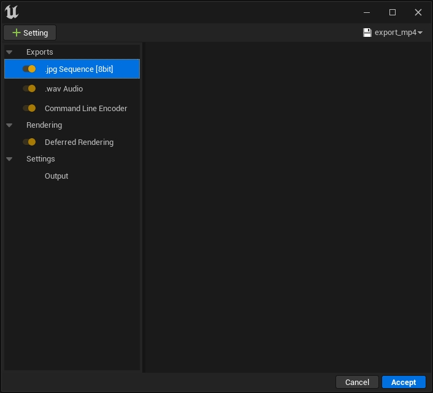

> 参考视频：https://www.youtube.com/watch?v=c39vdC7jloo&ab_channel=AzielArts

在 UE 中，我们可以通过关卡序列导出为视频，但在渲染时，我们只能选择 .jpg 序列，最后渲染出来的其实是十分多的图片，每一帧一张图片，实际上我们的视频就是由无数张图片组成的。另外，音频也会生成一个单独的文件，需要我们手动做合并。

此刻我们自然会去想，如果可以直接导出一个带音频的视频文件，这个视频就直接可用了。

## 解决方法

使用 UE5 中的一个 plugin：`Movie Pipeline CLI Encoder` 可以解决这个问题。与它的名字一样，这个插件的作用就是在输出视频的时候，执行一些命令行的操作，因此我们就可以通过这个插件，引入 `ffmpeg` 来在导出后自动合成视频与音频，实现这个需求。

我们首先需要在电脑上安装 `ffmpeg`，这一步就略过了。

然后我们需要在插件配置里指定 `ffmpeg` 的路径，同时指定音频与视频的编码器、输出文件类型。

最后在渲染队列中，在 .jpg 序列后添加 `Command Line Encoder` 导出选项，执行后生成的就是合成好的视频。

