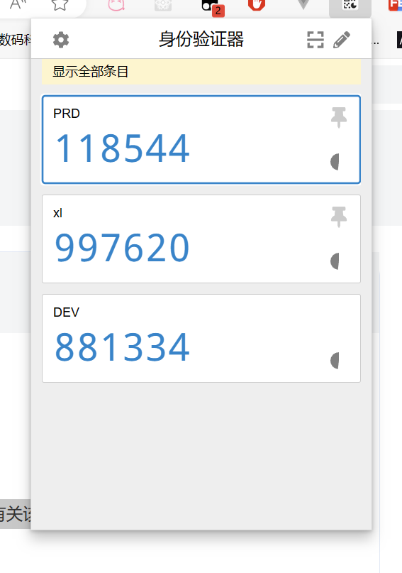
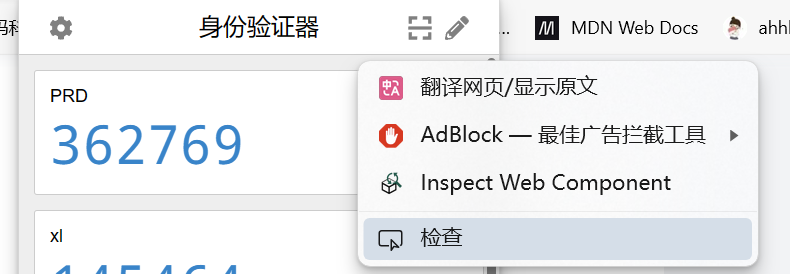

# chrome extension 系列

## 第一章——什么是浏览器插件

在谷歌浏览器或谷歌内核的浏览器里，提供了扩展的方式来**扩充浏览器的功能与体验**。

官方的说法是：Chrome 扩展程序可通过自定义界面、观察浏览器事件和修改网络来提升浏览体验。

打开 `chrome://extensions`，我们平时常见的扩展有：

- AdBlock
- 沉浸式翻译
- 油猴
- Vue.js devtools / React Developer Tools
- 身份验证器
- ModHeader
- ...

我们可以对上面列出的扩展进行一个总结，来看看它们做了什么，从而去了解扩展可以发挥什么样的作用。

---

简单地来说，我们可以将它们从功能角度进行归类：

- 介入网站页面
  - AdBlock：通过 DOM 移除的方式，清除了页面上的广告
  - 沉浸式翻译：将页面上的英文翻译成中文
- 提供额外功能
  - 身份验证器：点击扩展会展开一个弹窗，提供复制与添加谷歌码的功能
  - Vue.js devtools / React Developer Tools：在 devtools 里提供新的 tab 页，用于在开发过程中调试程序
- 拦截、屏蔽或修改网络请求
  - ModHeader：修改网络请求的请求头或重定向

在归类完以后，可以看到扩展能做的事情还是很全面的，它提供了介入网站页面的能力，同时也可以使用平时常见的 web 技术构建用户界面提供额外的功能，除此之外，还提供了一些较为底层的能力去控制网络。

> 官方文档：能做的事情https://developer.chrome.com/docs/extensions/develop?hl=zh-cn
>
> 笔者注：得益于 GPT 技术的快速发展，目前谷歌相关的开发者文档都通过 GPT 自动翻译成多种语言了，虽然有些词语还是没有特别准确，但是相较于直接阅读英文文档来说，体验上有了十分大的提升。所以建议在后续的开发过程中，我们可以多看看谷歌官方的开发者文档，这是我们可以阅读到的第一手资料。（记得需要**科学上网**！）

## 第二章——基础概念

通过阅读官方的文档，我们可以知道在 chrome extension 开发中，一个扩展程序是由不同角色的组件组成的。我们可以将其罗列一下：

- 清单（manifest.json）

  列出了有关该扩展程序的结构和行为的重要信息。

  https://developer.chrome.com/docs/extensions/reference/manifest?hl=zh-cn

- popup 弹出式窗口

  

- content 内容脚本

  注入到网页环境中，在实际网页环境中运行的脚本。

- background（service worker）后台服务

  Service Worker 在后台运行并处理浏览器事件，它们无权访问 DOM。同时，除非浏览器关闭，它就会一直运行着。

- sidePanel 侧边栏

- ...

## 第三章——manifest.json

> 在 2024 年，谷歌浏览器将彻底弃用 manifest V2 的扩展程序，因此后续文章中我们都将以 manifest V3 来进行讲解。
>
> https://developer.chrome.com/docs/extensions/develop/migrate/mv2-deprecation-timeline?hl=zh-cn

这是一个详细的 manifest.json 示例，包含了大多数常用的属性：

```json
{
  "manifest_version": 3,
  "default_locale": "en",
  /**
   * if you want to support multiple languages, you can use the following reference
   * https://developer.mozilla.org/en-US/docs/Mozilla/Add-ons/WebExtensions/Internationalization
   */
  "name": "__MSG_extensionName__",
  "version": 1.0,
  "description": "__MSG_extensionDescription__",
  // 需要的属性
  "permissions": ["storage", "sidePanel"],
  // 侧边栏应用路径
  "side_panel": {
    "default_path": "src/pages/sidepanel/index.html"
  },
  // 配置页面路径
  "options_page": "src/pages/options/index.html",
  // service worker脚本路径
  "background": {
    "service_worker": "src/pages/background/index.js",
    "type": "module"
  },
  // popup页面路径
  "action": {
    "default_popup": "src/pages/popup/index.html",
    "default_icon": "icon-34.png"
  },
  // 新tab页面
  "chrome_url_overrides": {
    "newtab": "src/pages/newtab/index.html"
  },
  // 扩展程序图标
  "icons": {
    "128": "icon-128.png"
  },
  // 注入到网站中的内容脚本路径
  "content_scripts": [
    {
      // 匹配上才会注入到页面中
      "matches": ["http://*/*", "https://*/*", "<all_urls>"],
      "js": ["src/pages/contentInjected/index.js"],
      // KEY for cache invalidation
      "css": ["assets/css/contentStyle<KEY>.chunk.css"]
    },
    {
      "matches": ["http://*/*", "https://*/*", "<all_urls>"],
      "js": ["src/pages/contentUi/index.js"]
    }
  ],
  // devtool 中功能路径
  "devtools_page": "src/pages/devtools/index.html",
  "web_accessible_resources": [
    {
      "resources": [
        "assets/js/*.js",
        "assets/css/*.css",
        "icon-128.png",
        "icon-34.png"
      ],
      "matches": ["*://*/*"]
    }
  ]
}
```

在 manifest V3 中，许多 API 支持了 Promise 写法，使得我们不用再使用回调方式去编写代码，而是可以使用我们常见的 async await 异步写法来编写代码。

## 第四章——popup

点击扩展程序按钮，将会有弹出的页面显示：


我们也可以右键点击弹出的元素进行检查，即我们平时常使用的 F12。



在写扩展程序功能的时候，我们会发现扩展弹出的界面的完整周期只有它展示在界面的那段时间(也就是说，扩展在关闭重新打开后，它的函数也跟着重新刷新，页面也重新渲染。

同时 popup 能访问的 chrome api 是有限的，一些比较敏感的 api 是无法在 popup 页面中使用的。

## 第五章——content

扩展程序十分常见的一个功能是注入到网页环境中，去操作网站的一些 DOM，或者执行一些第三方的逻辑。此时我们就需要使用到内容脚本功能。

讲解 world 和 isolate 的区别

## 第六章——background

顾名思义，background 即是后台的意思。在 chrome extension 中，除了我们可以直接接触到的 popup 和 side panel 以外，还有后台运行的环境，一些较为敏感的能力只有在 background 中才能使用。

在 chrome extension manifest v3 中，background 的运行环境是`Extension Service Worker`。`Service Worker` 的概念在 web 开发中我们已经接触过，简单来说它就是一个在背后默默工作的助手，独立于网页，使开发者能够在没有网页或用户交互的情况下运行特定的功能。

Service Worker 有几个特点：无法访问 DOM，发起网络请求需要使用 `fetch()` API 等。

### 生命周期

扩展 Service Worker 在需要时加载，并在其进入休眠状态时取消加载。一般来说，如果扩展程序在 30 秒后没有被使用，Chrome 就会将其暂停。

#### 安装

当 extension 被加载时，会发生安装，按顺序发生三个事件。

1. Web Service Worker 的 `install` 事件
2. `chrome.runtime.onInstalled`
3. Web Service Worker 的 `active` 事件

#### 空闲和关停

通常，Chrome 会在满足以下条件之一时终止 Service Worker：

- 无操作 30 秒后。收到事件或调用扩展程序 API 会重置此计时器。
- 单个请求（例如事件或 API 调用）的处理用时超过 5 分钟。
- 当 [`fetch()`](https://developer.mozilla.org/docs/Web/API/fetch) 响应的传递时间超过 30 秒时。

事件和对扩展程序 API 的调用会重置这些计时器，如果 Service Worker 已休眠，传入事件将使它们恢复。不过，您应该将 Service Worker 设计为能够灵活应对意外终止。

### 实时更新

上面说到，Service Worker 在不需要时会卸载。我们有在 worker 中使用 websocket 进行消息通信的需求时，是需要 worker 一直运行的。Chrome 会采用一系列启发法来确定扩展程序是否“正在使用”，其中之一是处于**活动状态的 WebSocket 连接**。Chrome 不会暂停在过去 30 秒内发送或接收 WebSocket 消息的扩展程序。

因此如果我们需要保持 worker 一直运行，我们可以使用心跳包的方式，以小于 30 秒的周期发送心跳包，来使 WebSocket 连接保持，同时令 worker 不被暂停。

### 事件

扩展程序 Service Worker 同时支持[标准 Service Worker](https://developer.mozilla.org/docs/Web/API/ServiceWorkerGlobalScope#events) 事件和[扩展程序 API](https://developer.chrome.com/docs/extensions/reference/api?hl=zh-cn) 中的许多事件。

Service Worker 中的事件处理脚本需要在全局范围内声明，这意味着它们应该**位于脚本的顶层**，而不应嵌套在函数内。

## 第七章——消息传递

上面说到了 popup、content、background 这几个概念，我们可以发现，这几个模块看起来都是相互独立的，但我们会有模块间通信的需求。

举个例子，我们需要在 popup 中配置一些页面上的功能，比如在 popup 中打开一个开关，就将页面上的某个元素移除掉。但 popup 无法访问页面的 DOM，此时我们在 popup 中操作时，就需要去通知 content，执行 content 中的一些逻辑对页面进行处理。此时我们就会接触到 chrome extension 中的消息传递相关的内容。

消息传递在 extension 中可以简单地分为以下两种情况：

- 扩展程序内消息传递（如 popup -> background 或 sidePanel -> background）

  **扩展程序内消息传递**通过 `chrome.runtime.sendMessage` 发送消息，使用 `chrome.runtime.onMessage.addEventListener `来监听消息。

  如果需要判断消息来源，可以通过监听消息回调函数中的 `sender` 属性来判断，以下是 popup -> background 的 `sender` 属性示例：

  ```json
  // chrome.runtime.onMessage.addEventListener 中 sender 属性
  {
    "id": "dmhihmcmfmkhdncmdaojodiifmpdgdje",
    "url": "chrome-extension://dmhihmcmfmkhdncmdaojodiifmpdgdje/src/pages/popup/index.html",
    "origin": "chrome-extension://dmhihmcmfmkhdncmdaojodiifmpdgdje"
  }
  ```

- 内容脚本与扩展程序间消息传递（即 content -> background 与 background -> content）

  **内容脚本往扩展程序发消息**依旧是通过 `chrome.runtime.sendMessage` 实现，但**扩展程序往内容脚本发消息**会相对复杂一点。

  在发消息时，需要先找到对应的 tab。在 chrome 浏览器中，一个浏览器可能会有许多不同的 tab，而我们的内容脚本也有可能会注入到不同的 tab 中，因此我们发消息之前需要先找到发往的地址。我们可以通过 `chrome.tabs.query` 这个方法找到对应的 tab 后，调用 `chrome.tabs.sendMessage` 方法来发送消息。

  ```javascript
  ;(async () => {
    const [tab] = await chrome.tabs.query({
      active: true,
      lastFocusedWindow: true,
    })
    const response = await chrome.tabs.sendMessage(tab.id, {
      greeting: 'hello',
    })
    // do something with response here, not outside the function
    console.log(response)
  })()
  ```

### 异步消息回调

有去了解过 API 的同学可能会发现，`chrome.runtime.sendMessage` 会返回一个 Promise，Promise 的结果是返回的内容。而接收方是如何发送这个回复的呢？在 `chrome.runtime.onMessage` 的回调函数中，有一个 `sendResponse` 的函数，调用这个函数即可发送回复。

```javascript
// content.js
const response = await chrome.runtime.sendMessage('hello') //response: 'nice to meet you'

// background.js
chrome.runtime.onMessage.addEventListener(function (
  request,
  sender,
  sendResponse
) {
  console.log(request)
  sendResponse('nice to meet you')
})
```

上面说的是理想的情况，但看到返回的结果用一个 Promise 包裹，我第一时间就想到了如果 sendResponse 不是马上发送，而是过一段时间才发送，如何也能正常地获取到返回的结果呢？

```javascript
// content.js
const response = await chrome.runtime.sendMessage('fetch something') //response: undefined

// background.js
chrome.runtime.onMessage.addEventListener(function (
  request,
  sender,
  sendResponse
) {
  console.log(request)
  fetch('https://something')
    .then((res) => res.json())
    .then((res) => {
      sendResponse('I got it!')
    })
})
```

运行了上述代码后，我们会发现 response 居然是 undefined，而不是我们预期的内容，这是为什么呢？

在查看了官方文档后，我们可以看到这一段话：

> **注意**：如果您使用回调，则 `sendResponse()` 回调仅在以下情况下有效：同步使用，或事件处理脚本返回 `true` 以指示它将异步响应。如果没有处理程序返回 `true` 或 `sendResponse()` 回调被垃圾回收，系统会自动调用 `sendMessage()` 函数的回调。

这个 GPT 直译说得比较糙，总结一下就是：`sendResponse`只在同步使用时有效，如果需要在异步响应时使用，需要在消息处理回调函数中 `return true` 来告诉请求方这是一个异步响应。

那我们是不是这样改就可以了呢？

```javascript
// content.js
const response = await chrome.runtime.sendMessage('fetch something') //response: 'I got it!'

// background.js
chrome.runtime.onMessage.addEventListener(function (
  request,
  sender,
  sendResponse
) {
  console.log(request)
  fetch('https://something')
    .then((res) => res.json())
    .then((res) => {
      sendResponse('I got it!')
    })
  return true
})
```

好消息，这样是可以的！在使用**同步方法**作为消息处理回调函数时，这样是可以的。但我们平时经常会使用 async/await 写法来处理异步操作，那如果我们使用 async 方法作为消息处理回调函数时，也能正常运行吗？

```javascript
// content.js
const response = await chrome.runtime.sendMessage('fetch something') //response: undefined

// background.js
chrome.runtime.onMessage.addEventListener(async function (
  request,
  sender,
  sendResponse
) {
  console.log(request)
  const fetchResponse = await fetch('https://something')
  sendResponse('I got it!')
  return true
})
```

此时我们发现，response 怎么又是 undefined 了？

这里面有一个知识点，`async` 函数的返回值其实是一个 `Promise`，这个处理函数的返回值被包装在 `Promise` 决议的结果中，因此 chrome 并没有接收到返回的 `true` 值，自然也不会把这个当成一个异步消息回调。

解决办法也很简单，我们无法使用 `async` 函数作为消息回调处理函数，那我们可以在同步函数内部定义一个 `async` 函数，并直接使用 IIFE 的方式执行，此时返回的 `true` 值会被 chrome 接收到，`sendResponse` 也能正常发送并被接收。示例代码如下：

```javascript
// background.js
chrome.runtime.onMessage.addListener((request, sender, sendResponse) => {
  ;(async () => {
    // 在这里面写异步的代码
    // ...
    const result = await getSomething()
    sendResponse(result)
  })()

  // 重点！返回 true 表示要异步发送响应
  return true
})
```

> 参考资料：https://stackoverflow.com/questions/44056271/chrome-runtime-onmessage-response-with-async-await

## 第八章——API

chrome.debugger 模拟用户行为

## 第九章——模块化系统开发

在之前的章节中，已经把 chrome extension 的基本概念学习了一遍。那在我们实际上手开发时，莫非也要像最初的前端一样，使用`index.html` 和 `index.js` 组织代码？

2024 年了，前端工程化早已不是新鲜事，我们可以使用框架来进行扩展的开发，引入 `vue` / `react` 来写界面，使用 `webpack` / `vite` 来进行代码打包与开发，这都不是事。

在 Vite 发展如此迅速的当下，我推荐使用 Vite 作为 bundler。在 [Awesome Vite](https://github.com/vitejs/awesome-vite) 中，我们可以找到一些现成的框架，例如：

- [chrome-extension-boilerplate-react-vite](https://github.com/Jonghakseo/chrome-extension-boilerplate-react-vite) - React + TypeScript + SASS + Prettier + ESLint + GitHub Actions + Chrome Extension Manifest v3.（1.5k star）
- [chrome-ext-template-preact-windi-vite](https://github.com/fell-lucas/chrome-ext-template-preact-windi-vite) - Preact, Windi CSS, TypeScript, Prettier, ESLint, GitHub Actions and Chrome Extension Manifest v3.（66 star）
- [vite-vue3-chrome-extension-v3](https://github.com/mubaidr/vite-vue3-chrome-extension-v3) - Web extension starter template for Chrome, Firefox and Edge.（279 star）

这些框架都提供了开箱即用的开发热更新、打包等功能，我们可以按需选用。

我自己在开发过程中，选取了最高 star 数的 [chrome-extension-boilerplate-react-vite](https://github.com/Jonghakseo/chrome-extension-boilerplate-react-vite) 作为框架，使用起来体验十分良好。它的项目结构也十分地明确，我们只需要在对应的文件夹下进行代码开发即可：

```bash
.
├── pages
│   ├── background  # 后台环境
│   ├── content # 内容脚本
│   ├── devtools # 开发者工具
│   ├── newtab # 新标签页
│   ├── options # 扩展选项页
│   ├── panel # 开发者工具页面
│   ├── popup # popup弹窗页面
│   └── sidepanel # 侧边栏页面
```
