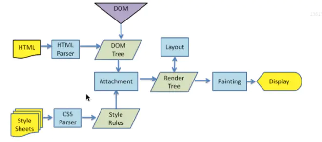

**从资源请求完成到页面的显示：**
1.  解析`HTML`字符串构建`DOM`树
2.  解析`CSS`样式，产生`CSSOM`树
3.  执行`js`脚本文件，`js`加载完成，通过`DOM API` 和 `CSSOM API` 来操作`DOM`树和`CSSOM`树
4.  浏览器根据`DOM`树和`CSSOM`树构建渲染树（rendering tree），渲染树包括显示的节点和节点显示的样式信息，如果某个节点设置了样式 `display: none`，那么就不会在渲染树中显示，如果设置`visibility:hidden`渲染树中存在该节点，但不显示。
5.  根据渲染树对每一个节点在页面上进行布局。（`reflow`）
6.  遍历渲染树，为每一个节点绘制对应的样式，显示到屏幕。(`repaint`)



白屏和`FOUC`主要是由于不同浏览器在加载资源时产生的不同问题。

**`FOUC`（无样式内容闪烁）**

`FOUC`是浏览器在加载资源时，加载多少渲染多少，直至完全加载成并计算渲染成功为止。
**白屏**

白屏是浏览器未加载完全部资源时，**选择等待全部资源加载完成**之后再进行计算和渲染的等待加载过程。

**关于`CSS`和`JS`的放置顺序：**

-   **使用`link`标签将样式表放在顶部**，是为了让`css`优先加载，防止页面上其他元素（图片，音频，视频等）的加载影响`css`的加载，同时`css`也会影响这些元素的加载（例如：浏览器的队列时间等）
-   **将`js`文件放在底部**
    1.  脚本会阻塞后面内容的呈现（需要等待脚本加载完成之后页面内的元素才会被呈现）
    2.  脚本会阻塞后面组件的下载（主要是影响图片和其他音频视频等资源的加载）
    3.  脚本用于操作页面上的元素，放在顶部时，元素仍未加载，未出现在文档流中容易出现报错。
    4.  脚本加载完成之后立即执行，如若碰到执行时间比较长，大量计算，循环甚至死循环时会影响后面资源的加载。
    5.  当我们使用一个**决定页面上所有元素的呈现的框架**时，可以将其放**置于顶部**，因为该框架不加载好、未执行，页面都是一片空白或是以混乱的样式呈现。
-   对于**图片和和`css`**，在**加载时会并发加载**（如一个域名下同时加载两个文件）。但是加载`JavaScript`时，会禁用并发，并且阻止其他内容的下载，所以将`JavaScript`放在页面顶部也会导致白屏现象。

**加载异步**

```html
<script src="script.js"> </script>
<script async src="script.js"></script>
<script defer src="script.js"></script>
```

- 没有`defer`或`async`，浏览器会立即加载并执行**指定的脚本。“立即”指的是在渲染该`script`标签之下的文档元素之前，也就是说不等待后续载入的文档元素，读到就加载并执行。**
- 有`async`，加载后续文档元素的过程和**js的加载与执行**并行进行（异步）。
-   有`defer`，加载后续文档的过程和`js`的**加载**并行进行（异步），但`js`的**执行**要在所有元素解析完成之后，`DOMContentLoaded`事件触发之前完成。
