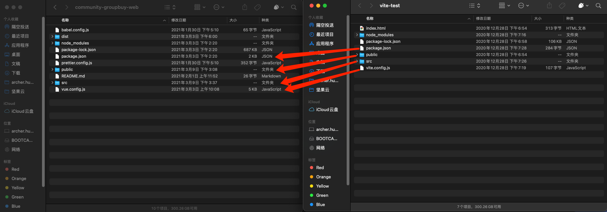
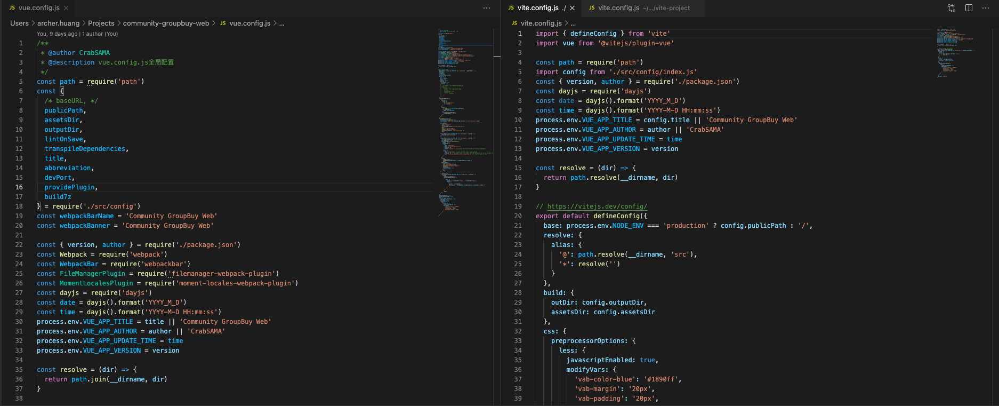
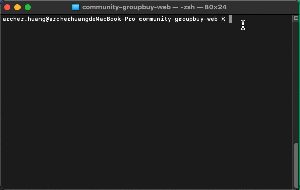

> `Vite1`仅仅试用过，`Vite2`已经更新了，全新插件架构，丝滑的开发体验，和`Vue3`的完美结合。 出于对尤大的信任与新技术的追求，在做毕设的我尝试着把项目移植到 Vite2 上。
>
> [Vite2官方文档](https://cn.vitejs.dev/)（看了一个星期的英文文档才发现原来中文文档也更新了 T.T）

## 目标

- 项目能移植到 Vite2 上正常运行，并且不存在影响运行的 bug
- 测试现有引入框架能否正常运行，不能正常运行有没有替代方案
- 分析 Vite2 的变化，如果项目使用 Vite2 有什么注意事项

## 从零开始搭建一个 Vite2 项目

```bash
npm init @vitejs/app
cd project
npm install
npm run dev
```

就这一行，简单粗暴，执行完后会让你选择对应的模板，Vite2 支持不同的框架，本文选择 Vue 即可。

一般通过脚手架初始化的 Vite 项目会在 `package.json`中添加 Vite 相关的 script，如果没有自己配置一下即可。

```json
{
  "scripts": {
    "dev": "vite", // 启动开发服务器
    "build": "vite build", // 为生产环境构建产物
    "serve": "vite preview" // 本地预览生产构建产物
  }
}
```

可以指定额外的命令行选项，如 `--port` 或 `--https`。运行 `npx vite --help` 获得完整的命令行选项列表。

## 移植现有项目（本文重点）

上面介绍了如何搭建一个全新的 Vite2 项目，但从我个人经验而言，现在由于 Vite2 刚发布，社区里关于如何移植现有项目到 Vite2 的例子是比较少的，以至于我找了好久也只找到了[一篇文章](https://www.vue-js.com/topic/6035bc2996b2cb0032c389de)（还是个卖课的就离谱）。但也感谢这篇文章给了我一些启发，现在就让我们开始吧~

由于官方现在还没给出完整的移植教程，我选用的方法是：

1. 新建一个 Vite2 + Vue 项目
2. 将现有项目代码迁移到该项目中
3. 根据报错一步一步进行调整



<center>左：VueCli4 项目 右：Vite2 + Vue 项目</center>

### 迁移项目代码

根据对两个项目的结构进行对比，可以发现的是我们需要将 `src`, `public` ,`package.json`, `.config.js` 这些目录与文件进行迁移。

- src：直接复制粘贴即可
- public：将里面的 `index.html` 复制到 Vite 项目的根目录，其余复制粘贴即可
- package.json：复制粘贴所有的 `dependencies`，`devDependencies`中除去 `webpack`,`vuecli`相关的依赖，其余复制粘贴即可（包括你需要用到的预处理器等）
- vue.config.js：这个是大头，需要注意，下面单独开一个小标题进行描述。

#### vue.config.js -> vite.config.js

新建完项目后我们会得到一个清爽的配置文件：

```js
import { defineConfig } from 'vite'
import vue from '@vitejs/plugin-vue'

// https://vitejs.dev/config/
export default defineConfig({
  plugins: [vue()]
})
```

现在让我们来开个分屏，对比一下 `vue.config.js`与`vite.config.js`的区别。



很多是不是？看着就让人头大。但我们一步一步来，这个也不会太难。

1. 需要明确的是，`vue.config.js`与`vite.config.js`一样，可以使用 `require` 引用 `path` 等模块。

2. 首先，上方的依赖我们可以按需迁移过来，但与 `webpack` 相关的依赖、代码就不需要了。

3. 把目光转移到导出的配置对象上，这里有几个一一对应的选项可以进行迁移：

   - publicPath -> base
   - assetsDir -> build.assetsDir
   - outputDir -> build.outDir
   - css.loaderOptions -> css.preprocessorOptions（本项目用的 antd-vue，因此使用的是 less）
   - css.loaderOptions.less.lessOptions ->css.preprocessorOptions.less

   上面就是我项目里面需要迁移的配置项，其余的大家可以自行配置，比如 devServer 的端口号等等配置。

   还是那句话，与 `webpack` 相关的，比如 `configWebpack`, `chainWebpack` 就不需要迁移了。

4. 别名通过 `resolve.alias` 进行配置即可

   ```js
   resolve: {
     alias: {
       '@': path.resolve(__dirname, 'src'),
       '*': resolve('')
     }
   }
   ```

由于我的项目并不是十分大型的项目，所以在完成上述操作后基本上已经将配置文件迁移好了。（我觉得应该也没有人会将大型项目移植到一个并不成熟的新框架上吧😹）

### 调整代码

由于 `Vite2` 使用了原生 ES Module 的方法来服务源码，在项目中有几个大点需要改动：

#### 不能在代码中使用 `require` 和 `module.export`

由于脱离了 `webpack` 环境，`Vite2` 将代码直接托管至浏览器，因此我们不能在代码中使用 nodejs 的 `require` 和 `module.export` 来进行模块的导出导入了。取而代之的是，将代码中有用到的地方改成原生 ES Module 方式。

- require('module') -> import * from 'module'
- module.export -> export { xx }, export default xx

#### 尽可能地在 import 时将文件后缀补全

感觉之前是 `webpack` 对后缀进行了补全，才让我们可以使用 `import someComponent from '@/views/someComponent'` 这种格式引入 `@/views/someComponent/index.vue`的文件。但在 Vite 中似乎没有了这种处理，因此我们在引用 `.vue` 文件时，后缀名不能省略。一般 `Vite` 报找不到文件的错误，可以首要考虑这个问题。

#### `path`等 nodejs 原生模块不能使用

由于脱离了 webpack 环境，在项目代码中不可以直接使用 `const path = require('path')`的方式来使用 `path` 等模块了，会报 `Module "path" has been externalized for browser compatibility and cannot be accessed in client code.`的错误。不过在现有项目中还是有很多地方用到 `path` 的，因此我的解决方案是通过 [`path-browserify`](https://www.npmjs.com/package/path-browserify)来解决，安装了该包后，将项目中用到 path 的地方换成 `import path from 'path-browserify'` 即可。

### 完成

在修改完上述问题后，可以重启一下 Vite 的服务器，看看效果，一般不会出现特别大的问题。这也是 `Vite2` 做得比较好的地方，方便用户可以比较轻松地迁移~

<center></img></center>

来看一下运行效果，相较于 VueCli，确实现在是秒开，HMR也十分快！

## 踩坑点

### 错误提示有待提升

相比于 `VueCli`，`Vite`的错误提示并不是十分友好，有些时候页面也不报错，控制台也不报错。这种情况可以针对上面提到的点，在代码中打断点调试一下。有可能在一些 utils 中使用了某些不支持的语法，但得益于 js “强大的”的错误兜底机制，错误并没有被捕获到，可以在一些有疑问的地方加个 try-catch 块看看。