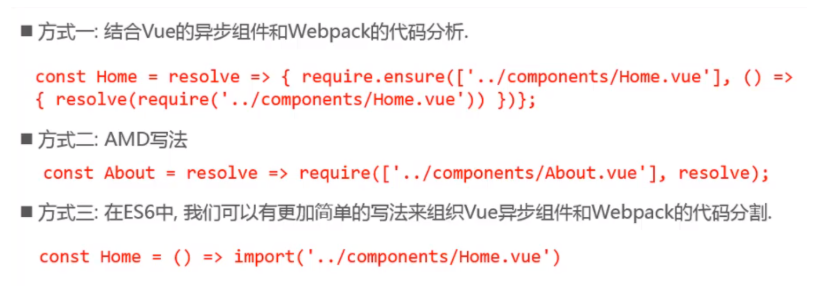
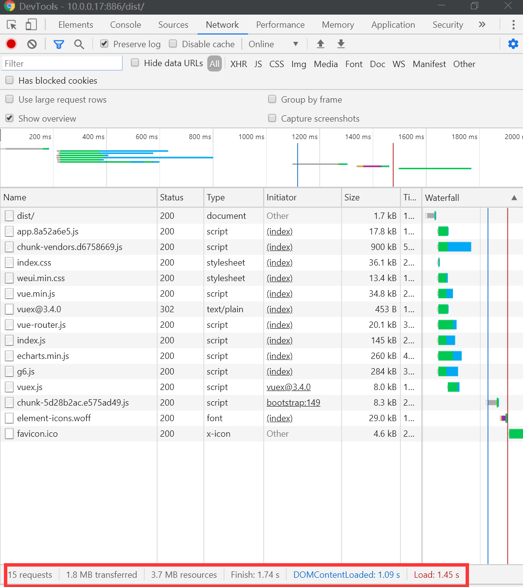

> 提升90%加载速度——vuecli下的首屏性能优化
> 
> [链接](https://segmentfault.com/a/1190000019499007)

> Vue SPA 首屏加载优化实践
> 
> [链接](https://juejin.im/post/5a291092518825293b50366d)

最近项目进行到了尾声，处于修改、测试阶段，老板对我们的项目中加载速度提出了一些意见。由于当前服务器部署在阿里云学生机上面，上下传速度只有1mbps，约等于140kb/s的速度，虽然前端打包下来只有5m左右的大小，在测试的过程中还是遇到了白屏时间巨久的情况：PC端载入10s左右，移动端载入20-30s左右，这实在是不能让人接受。因此，现在我要对我的项目进行一些优化，使得白屏现象得以改善。


<center>未优化前</center>

可以看到的是，在没有优化前，chunk-vendors文件已经有6.25MB之大，而这个文件在每次打开页面的时候都会进行一次加载，从而导致加载时间巨久无比。

* * *

在开始对项目进行优化之前，我寻找了一些资料，链接我放在了文章的最开头，可以点链接进入查看。在查找资料的过程中，我决定从这几方面下手：

*   路由懒加载（在之前已经实现了）
*   常用模块通过CDN进行加载
*   gzip压缩（未实现，需要后端配合）

## 路由懒加载 

在之前我已经对vue-route进行改造，全部使用了懒加载模式

```js
{
    path: "/main",
    component: () => import("../../views/PC/Main.vue"),
    meta: {
      title: "首页",
      requireLogin: true
}
```

重点代码就是这一行 
`() => import("../../views/PC/Main.vue")`
就是这么简单，将组件引入格式改成这样即可实现路由懒加载。  
原理是：以函数的形式动态引入，这样就可以把各自的路由文件分别打包，只有在解析给定的路由时，才会下载路由组件。 
这里面还有其他写法，见下图



<center>路由懒加载的不同写法</center>

虽然是对route进行了处理，但是实际运行时，我还是发现在加载首页的时候，就加载了一堆不相关的chunk文件，实际上来说还是没有实际减少加载量的效果，这又是为什么呢？ 
在查阅了[《提升90%加载速度——vuecli下的首屏性能优化》](https://segmentfault.com/a/1190000019499007)这篇文章后，我发现了一个概念：**prefetch**

> **prefetch**
> 
> 如果是在`vuecli 3`中，我们还需要多做一步工作。因为`vuecli 3`默认开启`prefetch`(预先加载模块)，提前获取用户未来可能会访问的内容，在首屏会把这十几个路由文件，都一口气下载了。所以我们要关闭这个功能，在`vue.config.js`中设置

在不作任何处理的情况下，vue-cli 3会默认开启`Prefetch`功能（[cli文档](https://cli.vuejs.org/zh/guide/html-and-static-assets.html#prefetch)）

默认情况下，一个 Vue CLI 应用会为所有作为 async chunk 生成的 JavaScript 文件 ([通过动态 `import()` 按需 code splitting](https://webpack.js.org/guides/code-splitting/#dynamic-imports) 的产物) 自动生成 prefetch 提示。

这就等于说，在没有任何操作的情况下，所有懒加载的组件，都会被标记上[<link rel="prefetch">](https://developer.mozilla.org/en-US/docs/Web/HTTP/Link_prefetching_FAQ)标记，浏览器将会一次性全都加载下来，因为你标记了即将使用到嘛，很简单的道理。很明确的是，我们不想要见到这种效果，我们想要路由懒加载的原因就是想要运用到了才加载，因此我们需要关闭这个功能，而关闭的方法也很简单

```js
// vue.config.js
module.exports = {
  chainWebpack: config => {
    // 移除 prefetch 插件
    config.plugins.delete('prefetch')

    // 或者
    // 修改它的选项：
    config.plugin('prefetch').tap(options => {
      options[0].fileBlacklist = options[0].fileBlacklist || []
      options[0].fileBlacklist.push(/myasyncRoute(.)+?\.js$/)
      return options
    })

  }
}
```

设置完毕后，首屏就只会加载当前页面路由的组件了。

## 使用CDN资源 

我们要将 `vue`、 `vue-router`、 `vuex`、`element-ui` 从 `vendor.js` 中分离出来，使用CDN资源引入。这些都是chunk-vendors.js里面的大头，我们可以通过vuecli3中vue ui打开的dashboard中“分析”看得出。


### 分析

1、首先在模板文件`index.html`中添加以下内容：

```html
...
<head>
    <meta charset="utf-8">
    <meta http-equiv="X-UA-Compatible" content="IE=edge">
    <meta name="viewport" content="width=device-width,initial-scale=1.0,user-scalable=no">
    <!--<script src="http://res.wx.qq.com/open/js/jweixin-1.6.0.js"></script>-->
    <link rel="icon" href="<%= BASE\_URL %>favicon.ico">
    <link href="https://cdn.bootcdn.net/ajax/libs/element-ui/2.13.1/theme-chalk/index.css" rel="stylesheet">
    <link rel="stylesheet" href="https://res.wx.qq.com/open/libs/weui/2.3.0/weui.min.css">
    <script src="https://cdn.bootcdn.net/ajax/libs/vue/2.6.11/vue.js"></script>
    <script src="https://unpkg.com/vuex@3.4.0"></script>
    <script src="https://unpkg.com/vue-router@3.1.6/dist/vue-router.js"></script>
    <script src="https://cdn.bootcdn.net/ajax/libs/element-ui/2.13.1/index.js"></script>
    <script src="https://cdn.bootcdn.net/ajax/libs/echarts/4.7.0/echarts.min.js"></script>
    <script src="https://gw.alipayobjects.com/os/antv/pkg/\_antv.g6-3.2.8/build/g6.js"></script>
</head>
<body>
  ...
</body>
```

2、修改 `vue.config.js`。（如果没有该文件，请与package.json同级下建立该文件，详情可见vuecli3文档） [`externals` 配置项](https://webpack.docschina.org/configuration/externals/)

```js
module.exports = {
  ...
  configureWebpack: {
    externals: {
      vue: "Vue",
      vuex: "Vuex",
      "vue-router": "VueRouter",
      "element-ui": "ELEMENT",
      echarts: "echarts",
      "@antv/g6": "G6"
    }
    ...
}
```

3、修改 `src/router/index.js`

```js
// import Vue from 'vue'
import VueRouter from 'vue-router'
// 注释掉
// Vue.use(VueRouter)
...
```

4、修改 `src/store/index.js`

```js
...
// 注释掉
// Vue.use(Vuex)
...
```

5、修改 `src/main.js`

```js
import Vue from 'vue'
import App from './App'
import axios from 'axios'
import store from './store'
import router from './router'
import ELEMENT from 'element-ui'
// import 'element-ui/lib/theme-chalk/index.css'

Vue.use(ELEMENT)

/\* eslint-disable no-new \*/
new Vue({
  el: '#app',
  store,
  router,
  template: '<App/>',
  components: { App }
})
```

注意！这里 `element-ui` 变量名要使用 `ELEMENT`，因为`element-ui`的 umd 模块名是 `ELEMENT`

在进行了这一系列操作之后，成功的将chunk-vendors.js降低到877.9kb！这已经是十分大的一个进步！


从这里依赖项也可以看出，vue、vue-router、vuex、element-ui已经被干掉了，取而代之的是在载入时通过CDN加载模块。（可以看到还有antv/g6、xlsx、cube-ui等没有用CDN加载，主要是还没找到好的办法555）

* * *

折腾了一下午+一晚上，可算是把加载速度降到可以接受的范围了（1.74s，部署在局域网服务器上）



### 加载流程

虽然已经达到了一些效果，但是我仍然有一些问题没有解决

1.  gzip的开启
2.  以Element-ui为例，我知道了它的umd名称，所以可以做到在externals内排除掉，但是如果是@antv/g6这种呢？要如何才可以在externals中排除掉？

* * *

**每天一点进步，总可以实现心中想要的东西！**