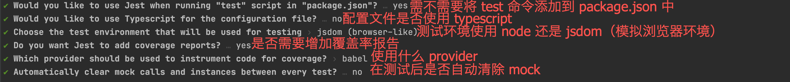
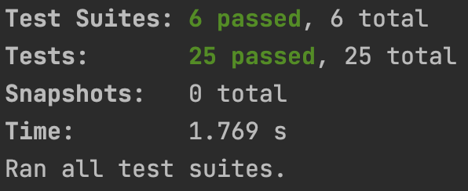
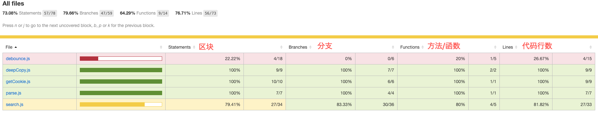

# 公用方法单元测试

## 使用场景

公共 function 和 公共 vue component

## 框架选型

> **[Jest](https://jestjs.io/docs/zh-Hans/getting-started)** 是功能最全的测试运行器。它所需的配置是最少的，默认安装了 JSDOM，内置断言且命令行的用户体验非常好。不过你需要一个能够将单文件组件导入到测试中的预处理器。我们已经创建了 `vue-jest` 预处理器来处理最常见的单文件组件特性，但仍不是 `vue-loader` 100% 的功能。
>
> [摘自 Vue Test Utils 官网](https://vue-test-utils.vuejs.org/zh/installation/#%E9%80%89%E6%8B%A9%E4%B8%80%E4%B8%AA%E6%B5%8B%E8%AF%95%E8%BF%90%E8%A1%8C%E5%99%A8)

在公共 function 的单元测试中，使用了 **Jest** 作为测试框架。

### 安装

`npm install --save-dev jest @babel/plugin-transform-modules-commonjs`

### 配置

`npx jest --init`



执行上述命令后根据命令行提示即可完成 jest 的初始化，得到一个位于根目录下的 jest.config.js 配置文件。

```json
// package.json
"scripts": {
  "test": "jest"  // 运行 jest 会自动扫描目录下 *.test.js 与 *.spec.js 文件并运行
}

// 根目录下建立 .babelrc 配置文件
{
  "env": {
    "test": {
      // 在测试环境中使用 babel 以支持 es6 的 import module 语法
      // 本质上 node 是支持大多数新语法的，如果有其他的不支持可以自行配置所需的 babel plugin
      "plugins": ["@babel/plugin-transform-modules-commonjs"]
    }
  }
}
```

## 测试工作

### 基础概念

来看一段实例代码：
```javascript
describe("number test", ()=>{
	it('1 is true', ()=>{
		expect(1).toBeTruthy()
	})
	test('2 is true',()=>{
		expect(2).toBeTruthy()
	})
})
```
名词解释：

- **describe** 描述, `decribe`会形成一个作用域
- **it** 断言
- **expect** 期望
- **test** 测试，类似`it`

实际写出来就是用 describe 包裹住一个模块的测试项目，然后使用 test / it 定义一个一个的测试项，向 expect 中传入执行后的结果，并使用 toBe() 等方法说明我们期望得到的结果。Jest 执行后就会自动判断两者是否相等，从而判断测试是否通过。

### 实操

首先我们先在项目根目录下建立 test 文件夹用于归类测试的代码。一般我们按照“模块名.test.js”或者“模块名.spec.js”的规范来对测试代码文件进行命名（eg: deepCopy.js 对应的测试代码名就是 deepCopy.test.js）。

以 parse function 为例，首先我们要阅读方法，看看在这个方法中存在什么值得测试的点。

```javascript
// parse.js
export const parse = function (str, key) {
    if (str) {
        try {
            return key ? JSON.parse(str)[key] : JSON.parse(str)
        } catch (err) {
            console.error('json格式错误: ', err)
            return false
        }
    } else {
        return false
    }
}
```

可以看到，这个方法有两个参数：str 是传入的 json 字符串，而 key 可以帮助快速找到转换完成后对象的取值。我们可以从两个方面下手，找到应该测试的点：

- 参数：类型、传值与否会导致方法不可用或报错
- 方法实现：实际代码实现中有没有会出现问题的点，比如测试是否能正确进入对应的 loop

在上面的 parse function 中，有两个参数，因此首先我们测试参数相关的内容，在这里我考虑到了两个参数的四种情况：str 类型错误，str 不是 json 格式，传不存在的 key，key 类型错误。

```javascript
// parse.test.js
describe("parse test", () => {
    test("str type error", () => {
        expect(parse(null)).toBeFalsy()
    })

    test("str format error", () => {
        expect(parse('{"a": "b"; "c": "d"}')).toBeFalsy()
    })

    test("key not include", () => {
        expect(parse('{"a": "b", "c": "d"}', "d")).toBeUndefined()
    })

    test("key type error", () => {
        expect(parse('{"a": "b", "c": "d"}', {})).toBeUndefined()
    })
})
```

接下来要考虑到的就是实际代码逻辑，这里我设定了两个场景：仅 parse 与 parse and get value。

```javascript
// parse.test.js
describe("parse test", () => {
		// ...
    test("only parse", () => {
        expect(parse('{"a": "b", "c": "d"}')).toEqual({a: "b", c: "d"})
    })

    test("parse and get value by key", () => {
        expect(parse('{"a": "b", "c": "d"}', "c")).toBe("d")
    })
})
```

测试代码编写完成后，我们可以直接运行一下 `npm run test` 来看看成果。



这里可以看到，我们编写的测试代码成功通过了，证明在我们定义的测试环境下是没有问题的。但是不代表我们的代码就完全不会出错了，毕竟我们永远都想象不到我们的用户有多么奇葩。￣□￣｜｜

实际上，测试的工作就是需要我们自己去想象这个方法会出现什么样的问题，通过人为地设定一些场景，判断实际得出的结果与预期的结果是否相同来判定代码是否合格。这需要我们设身处地地想象这些方法的使用情景。

## 代码覆盖率

代码覆盖率的意思就是我们的测试代码执行时跑过了多少地方，简单的来说：代码覆盖率 ＝ 代码的覆盖程度。

```javascript
// package.json
"scripts": {
  "test": "jest --coverage"  // 添加 --coverage 即可添加代码覆盖率的报告
}

// jest.config.js
module.exports = {
	// ...
  // Jest 将要输出覆盖率到何处
  coverageDirectory: "<rootDir>/test/coverage"
  // ...
}
```

上述配置做了两样事情，一是开启了代码覆盖率报告的生成，二是将代码覆盖率的输出目录指定到了根目录下的 test 文件夹中，保证了目录的整齐规范。在 jest.config.js 中还有许多其他的配置项，有兴趣的小伙伴可以自己研究一下。

打开其中的 lcov-report/index.html 文件，便通过可视化的方式查看代码覆盖率。



我们应该尽可能地增加测试的覆盖率，保证大多数测试都在绿色的状态下（80%以上）。