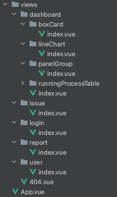

## 使用前请看

请确保文件目录与使用方式中的目录结构相同，才可以被正常监听并生成。

使用这种方式也可以令项目结构更加明了，与路由目录高度统一。

### 注意事项

- 空的文件夹将不做处理
- 如果**文件夹**名称为 `index` ，则默认判断为路由根目录
- 如果**文件**名称为 `index`，则当作路由的根页面
- 只有在**新建**或**删除**`.vue`文件时，才会触发路由配置文件更新操作
- 该命令生成的是 `route.js` 配置文件，请自行引入到 `vue-router` 中使用

## 使用方式

直接运行 终端命令
1. 命令需在**根目录**下执行
2. 默认监听的是 `@/src/views` 下的 `Vue` 文件；默认对 `child` 文件夹不做监听，可以创建一个 child 文件夹存放子组件
3. 如果需要自定义监听目录与子组件目录（子组件目录不做监听），需提前配好配置文件 bd.config.js
4. 输出的文件会在：`./src/router/routes.js`  内

```js
bd file-route  // 默认监听 @/src/views 下的 Vue 文件
```
配置文件 bd.config.js（根目录下） 模板参考如下：

```js
module.exports = {
  // fileRoute：此处适用于 fileRoute 的模块，其他工具有其他的key
  fileRoute: {
    path: 'components',
    childComponentDir: 'childComponent'
  }
}
```

根据如下目录结构生成：



- 自动生成 router.js 效果如下: 
```js
// routes.js
/* 此文件是自动生成的, 请用自助用编辑器格式化 */
export default [
  { path: '/404', component: () => import(/* webpackChunkName: 404 */'@/views/404.vue') }, {
    path: '/dashboard', component: () => import(/* webpackChunkName: dashboard */'@/views/dashboard/index.vue'),
    children: [
      {
        path: 'boxCard',
        component: () => import(/* webpackChunkName: dashboard-boxCard */'@/views/dashboard/boxCard/index.vue')
      },
      {
        path: 'lineChart',
        component: () => import(/* webpackChunkName: dashboard-lineChart */'@/views/dashboard/lineChart/index.vue')
      },
      {
        path: 'panelGroup',
        component: () => import(/* webpackChunkName: dashboard-panelGroup */'@/views/dashboard/panelGroup/index.vue')
      },
      {
        path: 'runningProcessTable',
        component: () => import(/* webpackChunkName: dashboard-runningProcessTable */'@/views/dashboard/runningProcessTable/index.vue')
      }

    ]
  },
  { path: '/issue', component: () => import(/* webpackChunkName: issue */'@/views/issue/index.vue') },
  { path: '/login', component: () => import(/* webpackChunkName: login */'@/views/login/index.vue') },
  { path: '/report', component: () => import(/* webpackChunkName: report */'@/views/report/index.vue') },
  { path: '/user', component: () => import(/* webpackChunkName: user */'@/views/user/index.vue') }
]

```
