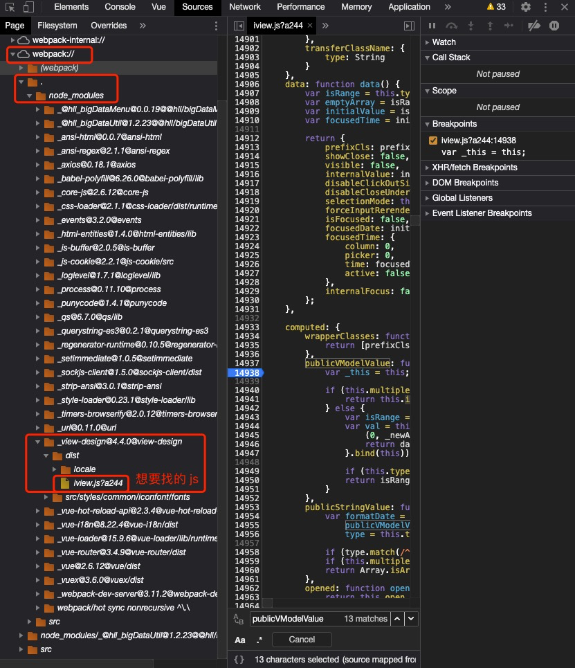

## 前提场景

使用 `webpack_dev_server` 的 `Vue` 项目

## 调试步骤

假设有一种需求，想要对引入的 `npm` 包进行调试，找出它里面的问题或者了解其运行的原理，我们就会涉及到对引入的包进行调试的需求，要解决的思路也比较简单。

1. 使用 `Chrome Dev Tool`

   我们可以直接运行项目，然后到 `Chrome` 中按 F12 打开 `Dev Tool`，切换到 `Source` 标签页。在这里面我们找到通过 `Webpack` 引入的包：

   

   在找到后，以 `iview` 这个包为例，我们可以看到它的打包方式是将很多个模块打包成一个 `js` 文件的形式，我们可以通过搜索找到对应的模块，直接打上断点即可调试。

2. 使用 IDE

   我们需要知道的一点是，其实我们直接 `import XXX from 'xxx'` 进来的包，本质上是指向了 `node_module` 下对应的文件夹。在每个标准的 `npm` 包中，都会有一个 `package.json` 文件，其中的 `main` 属性指向了以上述方式引入直接指向的 `js` 文件，所以其实我们 `import` 进来的就是这个 `js` 文件。

   因此我们可以直接杀到他家，在这个 `js` 文件中打上断点（`debugger`），在运行过程中就可以直接通过 `Dev Tool` 看到调试界面啦~（虽然这样还是要用到 `Chrome` 的 `Dev Tool`，但是在 `IDE` 中查看一些东西相对于 `Chrome` 还是更方便滴）

