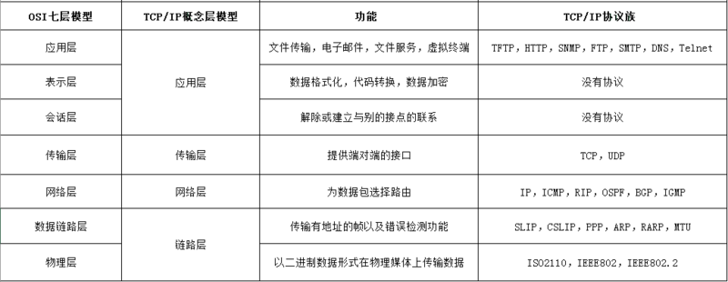
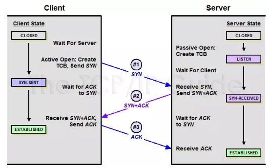
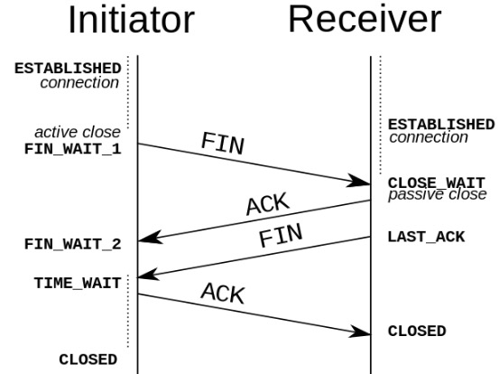

计算机与网络设备要相互通信，双方就必须基于相同的方法。这种规则就称之为协议。

**`TCP/IP`** 是互联网相关的各类协议族的总称，比如：`TCP`、`UDP`、`IP`、`FTP`、`HTTP`、`ICMP`、`SMTP` 都属于 `TCP/IP` 族内的协议。

**`TCP/IP`** 模型是互联网的基础，它是一系列网络协议的总称。这些协议可以划分为四层，分别为链路层、网络层、传输层和应用层。

- **链路层**：负责封装和解封装 `IP` 报文，发送和接受 `ARP/RARP` 报文等
- **网络层**：负责路由以及把分组报文发送给目标网络或主机
- **传输层**：负责对报文进行分组和重组，并以 `TCP` 或 `UDP` 协议格式封装报文
- **应用层**：负责向用户提供应用程序，比如 `HTTP`、`FTP`、`Telnet`、`DNS`、`SMTP` 等

## UDP

`UDP` 协议全称是用户数据报协议，在网络中它与 `TCP` 协议一样用于处理数据包，是一种无连接的协议。在 `OSI` 模型中，在第四层——传输层，处于 `IP` 协议的上一层。`UDP` 有不提供数据包分组、组装和不能对数据包进行排序的缺点，也就是说，当报文发送之后，是无法得知其**是否安全完整到达**的。

1. **面向无连接**

   `UDP` 是不需要和 `TCP` 一样在发送数据前进行三次握手建立连接的，**想发数据就可以开始发送了**。并且也只是数据报文的**搬运工**，不会对数据报文进行任何拆分和拼接操作。

   在发送端，应用层将数据传递给传输层的 `UDP` 协议，`UDP` 只会给数据增加一个 `UDP` 头标识下是 `UDP` 协议，然后就传递给网络层了；在接收端，网络层将数据传递给传输层，`UDP` 只去除 `IP` 报文头就传递给应用层，不会任何拼接操作。

2. **有单播，多播，广播的功能**

   `UDP` 不止支持一对一的传输方式，同时支持一对多，多对多，多对一的方式。

3. **UDP 是面向报文的**

   发送方的 `UDP` 对应用程序交下来的报文，在添加首部后就向下交付 `IP` 层。`UDP` 对应用层交下来的报文，**既不合并，也不拆分**，而是保留这些报文的边界。因此，应用程序必须选择**合适大小**的报文。

4. **不可靠性**

   首先不可靠性体现在**无连接**上，通信都不需要建立连接，想发就发，这样的情况肯定不可靠。

   并且收到什么数据就传递什么数据，并且也不会备份数据，发送数据也不会关心对方是否已经正确接收到数据了。

5. **头部开销小，传输数据报文时是很高效的**

   `UDP` 头部包含了：

   - 两个十六位的端口号，分别为源端口（可选字段）和目标端口
   - 整个数据报文的长度
   - 整个数据报文的检验和（IPv4 可选字段），该字段用于发现头部信息和数据中的错误

   因此 `UDP` 的头部开销小，只有八字节，相比 `TCP` 的至少二十字节要少得多

## TCP

当一台计算机想要与另一台计算机通讯时，两台计算机之间的通讯需要**畅通且可靠**，这样才能保证正确收发数据。

`TCP` 协议全称是传输控制协议，是一种**面向连接**、**可靠**的、**基于字节流**的传输通信协议。

1. **`TCP` 连接过程**

   

   - 第一次握手

   客户端想服务端发送连接请求报文段。该报文段中包含自身的数据通讯初始序号。请求发送后，客户端便进入 `SYN-SENT` 状态。

   - 第二次握手

   服务端收到连接请求报文段后，如果同意连接，则会发送一个应答，该应答也会包含自身的数据通讯初始序号，发送完成后便进入 `SYN-RECEIVED` 状态

   - 第三次握手

   当客户端收到连接同意的应答后，还要向服务端发送一个确认报文。客户端发完这个报文段就进入 `ESTABLISHED` 状态，服务端收到这个应答后也进入 `ESTABLISHED` 状态，此时连接建立成功。

2. **TCP 断开连接**

   `TCP` 是全双工的，在断开连接时两端都需要发送 `FIN` 和 `ACK`。

   

   - 第一次握手

     若客户端 A 认为数据发送完成，则它需要向服务端 B 发送连接释放请求。

   - 第二次握手

     B 收到连接释放请求后，会告诉应用层要释放 `TCP` 链接。然后会发送 `ACK` 包，并进入 CLOSE_WAIT 状态，此时表明 A 到 B 的连接已经释放，不再接收 A 发的数据了。但是因为 `TCP` 连接是双向的，所以 B 仍旧可以发送数据给 A。

   - 第三次握手

     B 如果此时还有没发完的数据会继续发送，完毕后会向 A 发送连接释放请求，然后 B 便进入 `LAST-ACK` 状态。

   - 第四层握手

     A 收到释放请求后，向 B 发送确认应答，此时 A 进入 `TIME-WAIT` 状态。该状态会持续 2MSL（最大段生存期，指报文段在网络中生存的时间，超时会被抛弃） 时间，若该时间段内没有 B 的重发请求的话，就进入 `CLOSED` 状态。当 B 收到确认应答后，也便进入 `CLOSED` 状态。

3. **`TCP` 协议的特点**

   - 面向连接

     面向连接，是指发送数据之前必须在两端**建立可靠的连接**。建立连接，是为数据的可靠性打下了基础。

   - 仅支持单播

     每条 `TCP` 传输连接只能有两个端点，只能进行**点对点**的数据传输，不支持多播和广播。

   - 面向字节流

     `TCP` 不像 `UDP` 那样一个个报文独立地传输，而是在不保留报文边界的情况下以**字节流方式**进行传输。

   - 可靠传输

     对于可靠传输，判断丢包、误码靠的是 `TCP` 的**段编号**以及**确认号**。`TCP` 为了保证报文传输的可靠，就给每个包一个序号，同时序号也保证了传送到接收端实体的包的**按序接收**。

   - 提供拥塞控制

     当网络出现拥塞的时候，`TCP` 能够减少向网络注入数据的速率和数量，缓解拥塞。

   - `TCP` 提供全双工通信

     `TCP` 允许通信双方的应用程序在任何时候都能发送数据。

## `TCP` 和 `UDP` 的比较

|                  | **`UDP`**                                  | **`TCP`**                              |
| ---------------- | ------------------------------------------ | -------------------------------------- |
| **是否连接**     | 无连接                                     | 面向连接                               |
| **是否可靠**     | 不可靠传输，不使用流量控制和拥塞控制       | 可靠传输，使用流量控制和拥塞控制       |
| **连接对象个数** | 支持一对一，一对多，多对一和多对多交互通信 | 只能是一对一通信                       |
| **传输方式**     | 面向报文                                   | 面向字节流                             |
| **首部开销**     | 首部开销小，仅8字节                        | 首部最小20字节，最大60字节             |
| **适用场景**     | 适用于实时应用（IP电话、视频会议、直播等） | 适用于要求可靠传输的应用，例如文件传输 |
